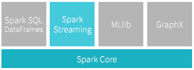
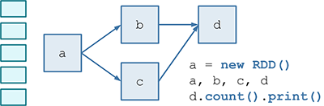
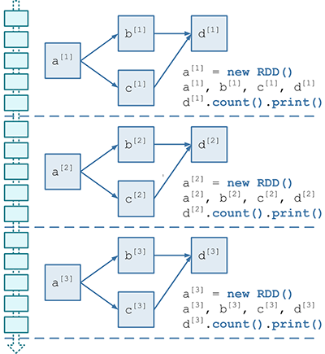
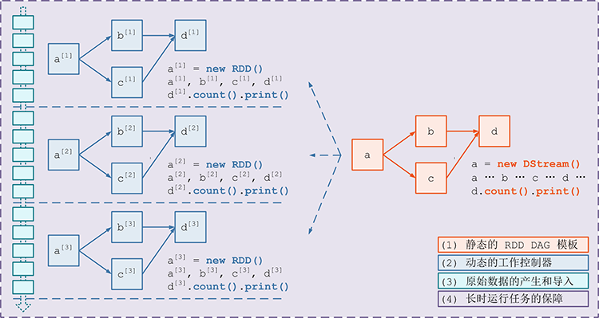
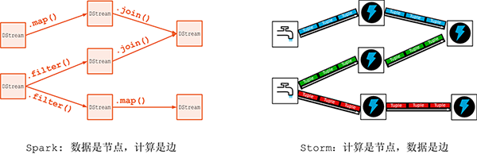
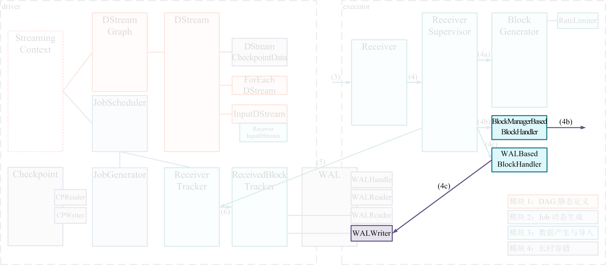

# Spark Streaming 实现思路与模块概述 #

***[酷玩 Spark] Spark Streaming 源码解析系列*** ，返回目录请 [猛戳这里](readme.md)

[「腾讯广告」](http://e.qq.com)技术团队（原腾讯广点通技术团队）荣誉出品

```
本系列内容适用范围：

* 2018.11.02 update, Spark 2.4 全系列 √ (已发布：2.4.0)
* 2018.02.28 update, Spark 2.3 全系列 √ (已发布：2.3.0 ~ 2.3.2)
* 2017.07.11 update, Spark 2.2 全系列 √ (已发布：2.2.0 ~ 2.2.3)
```
<br/>
<br/>

## 一、基于 Spark 做 Spark Streaming 的思路

Spark Streaming 与 Spark Core 的关系可以用下面的经典部件图来表述：



在本节，我们先探讨一下基于 Spark Core 的 RDD API，如何对 streaming data 进行处理。**理解下面描述的这个思路非常重要，因为基于这个思路详细展开后，就能够充分理解整个 Spark Streaming 的模块划分和代码逻辑**。

第一步，假设我们有一小块数据，那么通过 RDD API，我们能够构造出一个进行数据处理的 RDD DAG（如下图所示）。



第二步，我们对连续的 streaming data 进行切片处理 —— 比如将最近 200ms 时间的 event 积攒一下 —— 每个切片就是一个 batch，然后使用第一步中的 RDD DAG 对这个 batch 的数据进行处理。

> 注意: 这里我们使用的是 batch 的概念 —— 其实 200ms 在其它同类系统中通常叫做 mini-batch，不过既然 Spark Streaming 官方的叫法就是 batch，我们这里就用 batch 表达 mini-batch 的意思了 :)

所以，针对连续不断的 streaming data 进行多次切片，就会形成多个 batch，也就对应出来多个 RDD DAG（每个 RDD DAG 针对一个 batch 的数据）。如此一来，**这多个 RDD DAG 之间相互同构，却又是不同的实例**。我们用下图来表示这个关系：



所以，我们将需要：

- (1) 一个**静态**的 RDD DAG 的**模板**，来表示处理逻辑；

- (2) 一个**动态**的**工作控制器**，将连续的 streaming data 切分数据片段，并按照模板**复制**出新的 RDD DAG 的**实例**，对数据片段进行处理；


第三步，我们回过头来看 streaming data 本身的产生。Hadoop MapReduce, Spark RDD API 进行批处理时，一般默认数据已经在 HDFS, HBase 或其它存储上。而 streaming data —— 比如 twitter 流 —— 又有可能是在系统外实时产生的，就需要能够将这些数据导入到 Spark Streaming 系统里，就像 Apache Storm 的 Spout，Apache S4 的 Adapter 能够把数据导入系统里的作用是一致的。所以，我们将需要：

- (3) 原始数据的产生和导入；

第四步，我们考虑，有了以上 (1)(2)(3) 3 部分，就可以顺利用 RDD API 处理 streaming data 了吗？其实相对于 batch job 通常几个小时能够跑完来讲，streaming job 的运行时间是 +∞（正无穷大）的，所以我们还将需要：

- (4) 对长时运行任务的保障，包括输入数据的失效后的重构，处理任务的失败后的重调。

至此，streaming data 的特点决定了，如果我们想基于 Spark Core 进行 streaming data 的处理，还需要在 Spark Core 的框架上解决刚才列出的 (1)(2)(3)(4) 这四点问题：



## 二、Spark Streaming 的整体模块划分

根据 Spark Streaming 解决这 4 个问题的不同 focus，可以将 Spark Streaming 划分为四个大的模块：

- 模块 1：DAG 静态定义
- 模块 2：Job 动态生成
- 模块 3：数据产生与导入
- 模块 4：长时容错

其中每个模块涉及到的主要的类，示意如下：


这里先不用纠结每个类的具体用途，我们将在本文中简述，并在本系列的后续文章里对每个模块逐一详述。

### 2.1 模块 1：DAG 静态定义

通过前面的描述我们知道，应该首先对计算逻辑描述为一个 RDD DAG 的“模板”，在后面 Job 动态生成的时候，针对每个 batch，Spark Streaming 都将根据这个“模板”生成一个 RDD DAG 的实例。

#### DStream 和 DStreamGraph

其实在 Spark Streaming 里，这个 RDD “模板”对应的具体的类是 `DStream`，RDD DAG “模板”对应的具体类是 `DStreamGraph`。而 `RDD` 本身也有很多子类，几乎每个子类都有一个对应的 `DStream`，如 `UnionRDD` 的对应是 `UnionDStream`。`RDD` 通过 `transformation` 连接成 RDD DAG（但 RDD DAG 在 Spark Core 里没有对应的具体类），`DStream` 也通过 `transformation` 连接成 `DStreamGraph`。

    DStream      的全限定名是：org.apache.spark.streaming.dstream.DStream
    DStreamGraph 的全限定名是：org.apache.spark.streaming.DStreamGraph
    
#### DStream 和 RDD 的关系

既然 `DStream` 是 `RDD` 的模板，而且 `DStream` 和 `RDD` 具有相同的 *transformation* 操作，比如 map(), filter(), reduce() ……等等（正是这些相同的 *transformation* 使得 `DStreamGraph` 能够忠实记录 RDD DAG 的计算逻辑），那 `RDD` 和 `DStream` 有什么不一样吗？

还真不一样。

比如，`DStream` 维护了对每个产出的 `RDD` 实例的引用。比如下图里，`DStream A` 在 3 个 batch 里分别实例化了 3 个 `RDD`，分别是 `a[1]`, `a[2]`, `a[3]`，那么 `DStream A` 就保留了一个 `batch → 所产出的 RDD` 的哈希表，即包含 `batch 1 → a[1]`, `batch 2 → a[2]`, `batch 3 → a[3]` 这 3 项。


另外，能够进行流量控制的 `DStream` 子类，如 `ReceiverInputDStream`，还会保存关于历次 batch 的源头数据条数、历次 batch 计算花费的时间等数值，用来实时计算准确的流量控制信息，这些都是记在 `DStream` 里的，而 `RDD a[1]` 等则不会保存这些信息。

我们在考虑的时候，可以认为，`RDD` 加上 batch 维度就是 `DStream`，`DStream` 去掉 batch 维度就是 `RDD` —— 就像 `RDD = DStream at batch T`。

不过这里需要特别说明的是，在 `DStreamGraph` 的图里，DStream（即数据）是顶点，`DStream` 之间的 transformation（即计算）是边，这与 Apache Storm 等是相反的。

在 Apache Storm 的 topology 里，计算是顶点，stream（连续的 tuple，即数据）是边。这一点也是比较熟悉 Storm 的同学刚开始一下子不太理解 DStream 的原因--我们再重复一遍，DStream 即是数据本身，在有向图里是顶点、而不是边。


    
### 2.2 模块 2：Job 动态生成

现在有了 `DStreamGraph` 和 `DStream`，也就是静态定义了的计算逻辑，下面我们来看 Spark Streaming 是如何将其动态调度的。

在 Spark Streaming 程序的入口，我们都会定义一个 batchDuration，就是需要每隔多长时间就比照静态的 `DStreamGraph` 来动态生成一个 RDD DAG 实例。在 Spark Streaming 里，总体负责动态作业调度的具体类是 `JobScheduler`，在 Spark Streaming 程序开始运行的时候，会生成一个 `JobScheduler` 的实例，并被 start() 运行起来。

`JobScheduler` 有两个非常重要的成员：`JobGenerator` 和 `ReceiverTracker`。`JobScheduler` 将每个 batch 的 RDD DAG 具体生成工作委托给 `JobGenerator`，而将源头输入数据的记录工作委托给 `ReceiverTracker`。


    JobScheduler    的全限定名是：org.apache.spark.streaming.scheduler.JobScheduler
    JobGenerator    的全限定名是：org.apache.spark.streaming.scheduler.JobGenerator
    ReceiverTracker 的全限定名是：org.apache.spark.streaming.scheduler.ReceiverTracker

**`JobGenerator` 维护了一个定时器**，周期就是我们刚刚提到的 batchDuration，**定时为每个 batch 生成 RDD DAG 的实例**。具体的，每次 RDD DAG 实际生成包含 5 个步骤：

- (1) **要求 `ReceiverTracker` 将目前已收到的数据进行一次 allocate**，即将上次 batch 切分后的数据切分到到本次新的 batch 里；
- (2) **要求 `DStreamGraph` 复制出一套新的 RDD DAG 的实例**，具体过程是：`DStreamGraph` 将要求图里的尾 `DStream` 节点生成具体的 RDD 实例，并递归的调用尾 `DStream` 的上游 `DStream` 节点……以此遍历整个 `DStreamGraph`，遍历结束也就正好生成了 RDD DAG 的实例；
- (3) **获取第 1 步 `ReceiverTracker` 分配到本 batch 的源头数据的 meta 信息**；
- (4) 将第 2 步生成的本 batch 的 RDD DAG，和第 3 步获取到的 meta 信息，**一同提交给 `JobScheduler` 异步执行**；
- (5) 只要提交结束（不管是否已开始异步执行），就**马上对整个系统的当前运行状态做一个 checkpoint**。

上述 5 个步骤的调用关系图如下：


### 2.3 模块 3：数据产生与导入

下面我们看 Spark Streaming 解决第三个问题的模块分析，即数据的产生与导入。

`DStream` 有一个重要而特殊的子类 `ReceiverInputDStream`：它除了需要像其它 `DStream` 那样在某个 batch 里实例化 `RDD` 以外，还需要额外的 `Receiver` 为这个 `RDD` 生产数据！

具体的，Spark Streaming 在程序刚开始运行时：

- (1) 由 `Receiver` 的总指挥 `ReceiverTracker` 分发多个 job（每个 job 有 1 个 task），到多个 executor 上分别启动 `ReceiverSupervisor` 实例；

- (2) 每个 `ReceiverSupervisor` 启动后将马上生成一个用户提供的 `Receiver` 实现的实例 —— 该 `Receiver` 实现可以持续产生或者持续接收系统外数据，比如 `TwitterReceiver` 可以实时爬取 twitter 数据 —— 并在 `Receiver` 实例生成后调用 `Receiver.onStart()`；


    ReceiverSupervisor 的全限定名是：org.apache.spark.streaming.receiver.ReceiverSupervisor
    Receiver           的全限定名是：org.apache.spark.streaming.receiver.Receiver

(1)(2) 的过程由上图所示，这时 `Receiver` 启动工作已运行完毕。

接下来 `ReceiverSupervisor` 将在 executor 端作为的主要角色，并且：

- (3) `Receiver` 在 `onStart()` 启动后，就将**持续不断**地接收外界数据，并持续交给 `ReceiverSupervisor` 进行数据转储；

- (4) `ReceiverSupervisor` **持续不断**地接收到 `Receiver` 转来的数据：

	- 如果数据很细小，就需要 `BlockGenerator` 攒多条数据成一块(4a)、然后再成块存储(4b 或 4c)
	- 反之就不用攒，直接成块存储(4b 或 4c)
  
	- 这里 Spark Streaming 目前支持两种成块存储方式，一种是由 `BlockManagerBasedBlockHandler` 直接存到 executor 的内存或硬盘，另一种由 `WriteAheadLogBasedBlockHandler` 是同时写 WAL(4c) 和 executor 的内存或硬盘

- (5) 每次成块在 executor 存储完毕后，`ReceiverSupervisor` 就会及时上报块数据的 meta 信息给 driver 端的 `ReceiverTracker`；这里的 meta 信息包括数据的标识 id，数据的位置，数据的条数，数据的大小等信息；

- (6) `ReceiverTracker` 再将收到的块数据 meta 信息直接转给自己的成员 `ReceivedBlockTracker`，由 `ReceivedBlockTracker` 专门管理收到的块数据 meta 信息。


    BlockGenerator                 的全限定名是：org.apache.spark.streaming.receiver.BlockGenerator
    BlockManagerBasedBlockHandler  的全限定名是：org.apache.spark.streaming.receiver.BlockManagerBasedBlockHandler
    WriteAheadLogBasedBlockHandler 的全限定名是：org.apache.spark.streaming.receiver.WriteAheadLogBasedBlockHandler
    ReceivedBlockTracker           的全限定名是：org.apache.spark.streaming.scheduler.ReceivedBlockTracker
    ReceiverInputDStream           的全限定名是：org.apache.spark.streaming.dstream.ReceiverInputDStream

这里 (3)(4)(5)(6) 的过程是一直**持续不断**地发生的，我们也将其在上图里标识出来。

后续在 driver 端，就由 `ReceiverInputDStream` 在每个 batch 去检查 `ReceiverTracker` 收到的块数据 meta 信息，界定哪些新数据需要在本 batch 内处理，然后生成相应的 `RDD` 实例去处理这些块数据，这个过程在`模块 1：DAG 静态定义` `模块2：Job 动态生成` 里描述过了。
 
### 2.4 模块 4：长时容错

以上我们简述完成 Spark Streamimg 基于 Spark Core 所新增功能的 3 个模块，接下来我们看一看第 4 个模块将如何保障 Spark Streaming 的长时运行 —— 也就是，如何与前 3 个模块结合，保障前 3 个模块的长时运行。

通过前 3 个模块的关键类的分析，我们可以知道，保障模块 1 和 2 需要在 driver 端完成，保障模块 3 需要在 executor 端和 driver 端完成。

#### executor 端长时容错

先看 executor 端。

在 executor 端，`ReceiverSupervisor` 和 `Receiver` 失效后直接重启就 OK 了，关键是保障收到的块数据的安全。保障了源头块数据，就能够保障 RDD DAG （Spark Core 的 lineage）重做。

Spark Streaming 对源头块数据的保障，分为 4 个层次，全面、相互补充，又可根据不同场景灵活设置：

- **(1) 热备**：热备是指在存储块数据时，将其存储到本 executor、并同时 replicate 到另外一个 executor 上去。这样在一个 replica 失效后，可以立刻无感知切换到另一份 replica 进行计算。实现方式是，在实现自己的 Receiver 时，即指定一下 `StorageLevel` 为 `MEMORY_ONLY_2` 或 `MEMORY_AND_DISK_2` 就可以了。

> // 1.5.2 update 这已经是默认了。

- **(2) 冷备**：冷备是每次存储块数据前，先把块数据作为 log 写出到 `WriteAheadLog` 里，再存储到本 executor。executor 失效时，就由另外的 executor 去读 WAL，再重做 log 来恢复块数据。WAL 通常写到可靠存储如 HDFS 上，所以恢复时可能需要一段 recover time。



- **(3) 重放**：如果上游支持重放，比如 Apache Kafka，那么就可以选择不用热备或者冷备来另外存储数据了，而是在失效时换一个 executor 进行数据重放即可。

- **(4) 忽略**：最后，如果应用的实时性需求大于准确性，那么一块数据丢失后我们也可以选择忽略、不恢复失效的源头数据。

我们用一个表格来总结一下：

<table>
<tr>
	<td align="center"></td>
	<td align="center"><strong>图示</strong></td>
	<td align="center"><strong>优点</strong></td>
	<td align="center"><strong>缺点</strong></td>
</tr>
<tr>
	<td align="center"><strong>(1) 热备</strong></td>
	<td align="center"></img></td>
	<td align="center">无 recover time</td>
	<td align="center">需要占用双倍资源</td>
</tr>
<tr>
	<td align="center"><strong>(2) 冷备</strong></td>
	<td align="center"></img></td>
	<td align="center">十分可靠</td>
	<td align="center">存在 recover time</td>
</tr>
<tr>
	<td align="center"><strong>(3) 重放</strong></td>
	<td align="center"></img></td>
	<td align="center">不占用额外资源</td>
	<td align="center">存在 recover time</td>
</tr>
<tr>
	<td align="center"><strong>(4) 忽略</strong></td>
	<td align="center"></img></td>
	<td align="center">无 recover time</td>
	<td align="center">准确性有损失</td>
</tr>
</table>

#### driver 端长时容错

前面我们讲过，块数据的 meta 信息上报到 `ReceiverTracker`，然后交给 `ReceivedBlockTracker` 做具体的管理。`ReceivedBlockTracker` 也采用 WAL 冷备方式进行备份，在 driver 失效后，由新的 `ReceivedBlockTracker` 读取 WAL 并恢复 block 的 meta 信息。

另外，需要定时对 `DStreamGraph` 和 `JobScheduler` 做 `Checkpoint`，来记录整个 `DStreamGraph` 的变化、和每个 batch 的 job 的完成情况。

注意到这里采用的是完整 checkpoint 的方式，和之前的 WAL 的方式都不一样。`Checkpoint` 通常也是落地到可靠存储如 HDFS。`Checkpoint` 发起的间隔默认的是和 `batchDuration 一致`；即每次 batch 发起、提交了需要运行的 job 后就做 `Checkpoint`，另外在 job 完成了更新任务状态的时候再次做一下 `Checkpoint`。

这样一来，在 driver 失效并恢复后，可以读取最近一次的 `Checkpoint` 来恢复作业的 `DStreamGraph` 和 job 的运行及完成状态。

#### 总结 ####

<table>
    <tr>
        <td align="center"><strong>模块</strong></td>
        <td align="center" colspan="2"><strong>长时容错保障方式</strong></td>
    </tr>
    <tr>
        <td align="center">模块 1-DAG 静态定义</td>
        <td align="center">driver 端</td>
        <td>定时对 DStreamGraph 做 Checkpoint，来记录整个 DStreamGraph 的变化</td>
    </tr>
    <tr>
        <td align="center">模块 2-job 动态生成</td>
        <td align="center">driver 端</td>
        <td>定时对 JobScheduler 做 Checkpoint，来记录每个 batch 的 job 的完成情况</td>
    </tr>
    <tr>
        <td align="center">模块 3-数据产生与导入</td>
        <td align="center">driver 端</td>
        <td>源头块数据的 meta 信息上报 ReceiverTracker 时，写入 WAL</td>
    </tr>
    <tr>
        <td align="center">模块 3-数据产生与导入</td>
        <td align="center">executor 端</td>
        <td>对源头块数据的保障：(1) 热备；(2) 冷备；(3) 重放；(4) 忽略</td>
    </tr>
</table>

总结一下“模块4：长时容错”的内容为上述表格，可以看到，Spark Streaming 的长时容错特性，能够提供不重、不丢，exactly-once 的处理语义。

## 三、入口：StreamingContext

上面我们花了很多篇幅来介绍 Spark Streaming 的四大模块，我们在最后介绍一下 `StreamingContext`。

下面我们用这段仅 11 行的完整 [quick example](0.imgs/http://spark.apache.org/docs/latest/streaming-programming-guide.html#a-quick-example)，来说明用户 code 是怎么通过 `StreamingContext` 与前面几个模块进行交互的：

```scala
import org.apache.spark._
import org.apache.spark.streaming._

// 首先配置一下本 quick example 将跑在本机，app name 是 NetworkWordCount
val conf = new SparkConf().setMaster("local[2]").setAppName("NetworkWordCount")
// batchDuration 设置为 1 秒，然后创建一个 streaming 入口
val ssc = new StreamingContext(conf, Seconds(1))

// ssc.socketTextStream() 将创建一个 SocketInputDStream；这个 InputDStream 的 SocketReceiver 将监听本机 9999 端口
val lines = ssc.socketTextStream("localhost", 9999)

val words = lines.flatMap(_.split(" "))      // DStream transformation
val pairs = words.map(word => (word, 1))     // DStream transformation
val wordCounts = pairs.reduceByKey(_ + _)    // DStream transformation
wordCounts.print()                           // DStream output
// 上面 4 行利用 DStream transformation 构造出了 lines -> words -> pairs -> wordCounts -> .print() 这样一个 DStreamGraph
// 但注意，到目前是定义好了产生数据的 SocketReceiver，以及一个 DStreamGraph，这些都是静态的

// 下面这行 start() 将在幕后启动 JobScheduler, 进而启动 JobGenerator 和 ReceiverTracker
// ssc.start()
//    -> JobScheduler.start()
//        -> JobGenerator.start();    开始不断生成一个一个 batch
//        -> ReceiverTracker.start(); 开始往 executor 上分布 ReceiverSupervisor 了，也会进一步创建和启动 Receiver
ssc.start()

// 然后用户 code 主线程就 block 在下面这行代码了
// block 的后果就是，后台的 JobScheduler 线程周而复始的产生一个一个 batch 而不停息
// 也就是在这里，我们前面静态定义的 DStreamGraph 的 print()，才一次一次被在 RDD 实例上调用，一次一次打印出当前 batch 的结果
ssc.awaitTermination()
```

所以我们看到，`StreamingContext` 是 Spark Streaming 提供给用户 code 的、与前述 4 个模块交互的一个简单和统一的入口。

## 四、总结与回顾

在最后我们再把 [Sark Streaming 官方 Programming Guide](http://spark.apache.org/docs/latest/streaming-programming-guide.html#a-quick-example) 的部分内容放在这里，作为本文的一个回顾和总结。请大家看一看，如果看懂了本文的内容，是不是读下面这些比较 high-level 的介绍会清晰化很多 :-)

> **Spark Streaming** is an extension of the **core Spark API** that enables **scalable**, **high-throughput**, **fault-tolerant stream processing of live data streams**. Data can be ingested from many sources like Kafka, Flume, Twitter, ZeroMQ, Kinesis, or TCP sockets, and can be processed using complex algorithms expressed with high-level functions like map, reduce, join and window. Finally, processed data can be pushed out to filesystems, databases, and live dashboards. In fact, you can apply Spark’s machine learning and graph processing algorithms on data streams.

> 

> Internally, it works as follows. **Spark Streaming receives live input data streams and divides the data into batches, which are then processed by the Spark engine to generate the final stream of results in batches**.

> 

> Spark Streaming provides a high-level abstraction called **discretized stream** or **DStream**, which represents a continuous stream of data. DStreams can be created either from input data streams from sources such as Kafka, Flume, and Kinesis, or by applying high-level operations on other DStreams. **Internally, a DStream is represented as a sequence of RDDs**.

> ...

##知识共享


除非另有注明，本文及本《Spark Streaming 源码解析系列》系列文章使用 [CC BY-NC（署名-非商业性使用）](https://creativecommons.org/licenses/by-nc/4.0/) 知识共享许可协议。

<br/>
<br/>

（本文完，参与本文的讨论请 [猛戳这里](https://github.com/proflin/CoolplaySpark/issues/1)，返回目录请 [猛戳这里](readme.md)）
