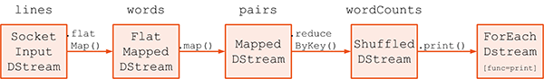

# DStream, DStreamGraph 详解 #

***[酷玩 Spark] Spark Streaming 源码解析系列*** ，返回目录请 [猛戳这里](readme.md)

[「腾讯广告」](http://e.qq.com)技术团队（原腾讯广点通技术团队）荣誉出品

```
本系列内容适用范围：

* 2018.11.02 update, Spark 2.4 全系列 √ (已发布：2.4.0)
* 2018.02.28 update, Spark 2.3 全系列 √ (已发布：2.3.0 ~ 2.3.2)
* 2017.07.11 update, Spark 2.2 全系列 √ (已发布：2.2.0 ~ 2.2.3)
```
<br/>
<br/>

阅读本文前，请一定先阅读 [Spark Streaming 实现思路与模块概述](0.1 Spark Streaming 实现思路与模块概述.md) 一文，其中概述了 Spark Streaming 的 4 大模块的基本作用，有了全局概念后再看本文对 `模块 1 DAG 静态定义` 细节的解释。

## 引言

我们在前面的文章讲过，Spark Streaming 的 `模块 1 DAG 静态定义` 要解决的问题就是如何把计算逻辑描述为一个 RDD DAG 的“模板”，在后面 Job 动态生成的时候，针对每个 batch，都将根据这个“模板”生成一个 RDD DAG 的实例。


在 Spark Streaming 里，这个 RDD “模板”对应的具体的类是 `DStream`，RDD DAG “模板”对应的具体类是 `DStreamGraph`。

    DStream      的全限定名是：org.apache.spark.streaming.dstream.DStream
    DStreamGraph 的全限定名是：org.apache.spark.streaming.DStreamGraph


本文涉及的类在 Spark Streaming 中的位置如上图所示；下面详解 `DStream`, `DStreamGraph`。

## DStream, *transformation*, *output operation* 解析

回想一下，RDD 的定义是一个只读、分区的数据集（`an RDD is a read-only, partitioned collection of records`），而 DStream 又是 RDD 的模板，所以我们把 Dstream 也视同数据集。

我们先看看定义在这个 DStream 数据集上的*转换*（***transformation***）和 *输出*（***output***）。

现在假设我们有一个 `DStream` 数据集 a：

```scala
val a = new DStream()
```

那么通过 `filter()` 操作就可以从 `a` 生成一个新的 `DStream` 数据集 `b`：

```scala
val b = a.filter(func)
```

这里能够由已有的 `DStream` 产生新 `DStream` 的操作统称 ***transformation***。一些典型的 *tansformation* 包括 `map()`, `filter()`, `reduce()`, `join()` 等 。

> Transformation	Meaning
map(func)	Return a new DStream by passing each element of the source DStream through a function func.
flatMap(func)	Similar to map, but each input item can be mapped to 0 or more output items.
filter(func)	Return a new DStream by selecting only the records of the source DStream on which func returns true.
repartition(numPartitions)	Changes the level of parallelism in this DStream by creating more or fewer partitions.


另一些不产生新 `DStream` 数据集，而是只在已有 `DStream` 数据集上进行的操作和输出，统称为 ***output***。比如 `a.print()` 就不会产生新的数据集，而是只是将 `a` 的内容打印出来，所以 `print()` 就是一种 *output* 操作。一些典型的 *output* 包括 `print()`, `saveAsTextFiles()`, `saveAsHadoopFiles()`, `foreachRDD()` 等。

> print()	Prints the first ten elements of every batch of data in a DStream on the driver node running the streaming application. This is useful for development and debugging. 
Python API This is called pprint() in the Python API.
saveAsTextFiles(prefix, [suffix])	Save this DStream's contents as text files. The file name at each batch interval is generated based on prefix and suffix: "prefix-TIME_IN_MS[.suffix]".
saveAsObjectFiles(prefix, [suffix])	Save this DStream's contents as SequenceFiles of serialized Java objects. The file name at each batch interval is generated based on prefix and suffix: "prefix-TIME_IN_MS[.suffix]". 
Python API This is not available in the Python API.
saveAsHadoopFiles(prefix, [suffix])	Save this DStream's contents as Hadoop files. The file name at each batch interval is generated based on prefix and suffix: "prefix-TIME_IN_MS[.suffix]". 
Python API This is not available in the Python API.
foreachRDD(func)	The most generic output operator that applies a function, func, to each RDD generated from the stream. This function should push the data in each RDD to an external system, such as saving the RDD to files, or writing it over the network to a database. Note that the function func is executed in the driver process running the streaming application, and will usually have RDD actions in it that will force the computation of the streaming RDDs.

## 一段 quick example 的 *transformation*, *output* 解析

我们看一下 [Spark Streaming 官方的 quick example](0.imgs/http://spark.apache.org/docs/latest/streaming-programming-guide.html#a-quick-example) 的这段对 DStream DAG 的定义，注意看代码中的注释讲解内容：

```scala
// ssc.socketTextStream() 将创建一个 SocketInputDStream；这个 InputDStream 的 SocketReceiver 将监听本机 9999 端口
val lines = ssc.socketTextStream("localhost", 9999)

val words = lines.flatMap(_.split(" "))      // DStream transformation
val pairs = words.map(word => (word, 1))     // DStream transformation
val wordCounts = pairs.reduceByKey(_ + _)    // DStream transformation
wordCounts.print()                           // DStream output
```

这里我们找到 `ssc.socketTextStream("localhost", 9999)` 的源码实现：

```scala
def socketStream[T: ClassTag](
  hostname: String,
  port: Int, 
  converter: (InputStream) => Iterator[T],
  storageLevel: StorageLevel)
  : ReceiverInputDStream[T] = {
    new SocketInputDStream[T](this, hostname, port, converter, storageLevel)
  }
```

也就是 `ssc.socketTextStream()` 将 `new` 出来一个 `DStream` 具体子类 `SocketInputDStream` 的实例。

然后我们继续找到下一行 `lines.flatMap(_.split(" "))` 的源码实现：

```scala
def flatMap[U: ClassTag](flatMapFunc: T => Traversable[U]): DStream[U] = ssc.withScope {
    new FlatMappedDStream(this, context.sparkContext.clean(flatMapFunc))
  }
```

也就是 `lines.flatMap(_.split(" "))` 将 `new` 出来一个 `DStream` 具体子类 `FlatMappedDStream` 的实例。

后面几行也是如此，所以我们如果用 DStream DAG 图来表示之前那段 quick example 的话，就是这个样子：



也即，我们给出的那段代码，用具体的实现来替换的话，结果如下：

```scala
val lines = new SocketInputDStream("localhost", 9999)   // 类型是 SocketInputDStream

val words = new FlatMappedDStream(lines, _.split(" "))  // 类型是 FlatMappedDStream
val pairs = new MappedDStream(words, word => (word, 1)) // 类型是 MappedDStream
val wordCounts = new ShuffledDStream(pairs, _ + _)      // 类型是 ShuffledDStream
new ForeachDStream(wordCounts, cnt => cnt.print())      // 类型是 ForeachDStream
```

总结一下：

- *transformation*：可以看到基本上 1 种 *transformation* 将对应产生一个新的 `DStream` 子类实例，如：
	- `.flatMap()` 将产生 `FaltMappedDStream` 实例
	- `.map()`     将产生 `MappedDStream` 实例
- *output*：将只产生一种 `ForEachDStream` 子类实例，用一个函数 `func` 来记录需要做的操作
	- 如对于 `print()` 就是：`func` = `cnt => cnt.print()`

我们将有另一篇文章具体对 `DStream` 所有 *transformation* 的列举和分析，本文不展开。

## DStream 类继承体系

上面我们看到的 `SocketInputDStream`, `FlatMappedDStream`, `ForeachDStream` 等都是 `DStream` 的具体子类。

`DStream` 的所有子类如下：


一会我们要对其这些 `DStream` 子类进行一个分类。

## Dependency, DStreamGraph 解析

先再次回过头来看一下 *transformation* 操作。当我们写代码 `c = a.join(b), d = c.filter()` 时， 它们的 DAG 逻辑关系是 `a/b → c，c → d`，但在 Spark Streaming 在进行物理记录时却是反向的 `a/b ← c, c ← d`，如下图：


那物理上为什么不顺着 DAG 来正向记录，却用反向记录？

这里背后的原因是，在 Spark Core 的 RDD API 里，RDD 的计算是被触发了以后才进行 lazy 求值的，即当真正求 `d` 的值的时候，先计算上游 dependency `c`；而计算 `c` 则先进一步计算 `c` 的上游 dependency `a` 和 `b`。Spark Streaming 里则与 RDD DAG 的反向表示保持了一致，对 DStream 也采用的反向表示。

所以，这里 `d` 对 `c` 的引用，表达的是一个上游*依赖*（***dependency***）的关系；也就是说，不求值则已，一旦 `d.print()` 这个 *output* 操作触发了对 `d` 的求值，那么就需要从 `d` 开始往上游进行追溯计算。

具体的过程是，`d.print()` 将 `new` 一个 `d` 的一个下游 `ForEachDStream x` —— `x` 中记明了需要做的操作 `func = print()` —— 然后在每个 batch 动态生成 RDD 实例时，以 `x` 为根节点、进行一次 BFS（宽度优先遍历），就可以快速得到需要进行实际计算的最小集合。如下图所示，这个最小集合就是 {`a`, `b`, `c`, `d`}。


再看一个例子。如下图所示，如果对 `d`, `f` 分别调用 `print()` 的 *output* 操作，那么将在 `d`, `f` 的下游分别产生新的 `DStream x, y`，分别记录了具体操作 `func = print()`。在每个 batch 动态生成 RDD 实例时，就会分别对 `x` 和 `y` 进行 BFS 遍历，分别得到上游集合 {`a`,`b`,`c`,`d`} 和 {`b`,`e`,`f`}。作为对比，这里我们不对 `h` 进行 `print()` 的 *output* 操作，所以 `g`, `h` 将得不到遍历。


通过以上分析，我们总结一下：

- (1) DStream 逻辑上通过 *transformation* 来形成 DAG，但在物理上却是通过与 *transformation* 反向的*依赖*（***dependency***）来构成表示的

- (2) 当某个节点调用了 *output* 操作时，就产生一个新的 `ForEachDStream` ，这个新的 `ForEachDStream` 记录了具体的 *output* 操作是什么

- (3) 在每个 batch 动态生成 RDD 实例时，就对 (2) 中新生成的 `DStream` 进行 BFS 遍历

我们将在 (2) 中，由 *output* 操作新生成的 `DStream` 称为 *output stream*。

最后，我们给出：

- (4) **Spark Streaming 记录整个 DStream DAG 的方式，就是通过一个 `DStreamGraph` 实例记录了到所有的 *output stream* 节点的引用**
	- 通过对所有 *output stream* 节点进行遍历，就可以得到所有上游依赖的 `DStream`
	- 不能被遍历到的 `DStream` 节点 —— 如 `g` 和 `h` —— 则虽然出现在了逻辑的 DAG 中，但是并不属于物理的 `DStreamGraph`，也将在 Spark Streaming 的实际运行过程中不产生任何作用

- (5) `DStreamGraph` 实例同时也记录了到所有 *input stream* 节点的引用
	- DStreamGraph 时常需要遍历没有上游依赖的 `DStream` 节点 —— 称为 *input stream* —— 记录一下就可以避免每次为查找 *input stream* 而对 *output steam* 进行 BFS 的消耗

我们本节所描述的内容，用下图就能够总结了：


<br/>
<br/>

（本文完，参与本文的讨论请 [猛戳这里](https://github.com/proflin/CoolplaySpark/issues/2)，返回目录请 [猛戳这里](readme.md)）
