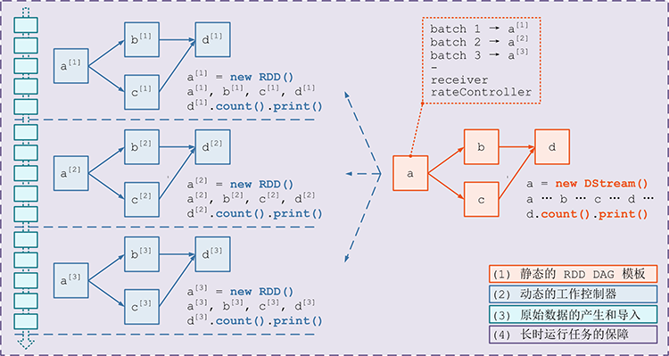
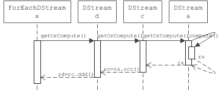
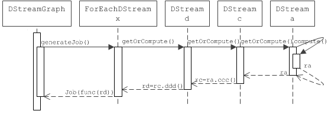
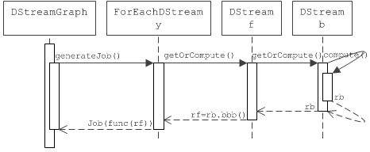
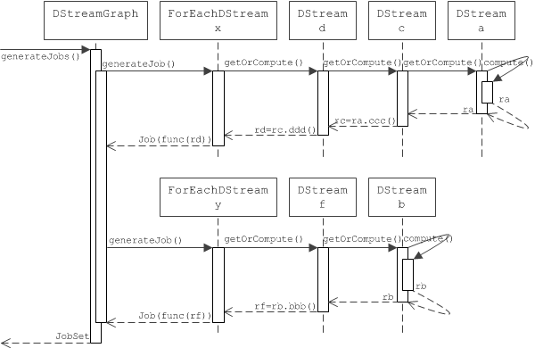

# DStream 生成 RDD 实例详解 #

***[酷玩 Spark] Spark Streaming 源码解析系列*** ，返回目录请 [猛戳这里](readme.md)

[「腾讯广告」](http://e.qq.com)技术团队（原腾讯广点通技术团队）荣誉出品

```
本系列内容适用范围：

* 2018.11.02 update, Spark 2.4 全系列 √ (已发布：2.4.0)
* 2018.02.28 update, Spark 2.3 全系列 √ (已发布：2.3.0 ~ 2.3.2)
* 2017.07.11 update, Spark 2.2 全系列 √ (已发布：2.2.0 ~ 2.2.3)
```
<br/>
<br/>

阅读本文前，请一定先阅读 [Spark Streaming 实现思路与模块概述](0.1 Spark Streaming 实现思路与模块概述.md) 一文，其中概述了 Spark Streaming 的 4 大模块的基本作用，有了全局概念后再看本文对 `模块 1 DAG 静态定义` 细节的解释。

## 引言

我们在前面的文章讲过，Spark Streaming 的 `模块 1 DAG 静态定义` 要解决的问题就是如何把计算逻辑描述为一个 RDD DAG 的“模板”，在后面 Job 动态生成的时候，针对每个 batch，都将根据这个“模板”生成一个 RDD DAG 的实例。


在 Spark Streaming 里，这个 RDD “模板”对应的具体的类是 `DStream`，RDD DAG “模板”对应的具体类是 `DStreamGraph`。

    DStream      的全限定名是：org.apache.spark.streaming.dstream.DStream
    DStreamGraph 的全限定名是：org.apache.spark.streaming.DStreamGraph

本文我们就来详解 `DStream` 最主要的功能：为每个 batch 生成 `RDD` 实例。

## Quick Example ##


我们在前文 [DStream, DStreamGraph 详解](1.1 DStream, DStreamGraph 详解.md) 中引用了 [Spark Streaming 官方的 quick example](0.imgs/http://spark.apache.org/docs/latest/streaming-programming-guide.html#a-quick-example) 的这段对 DStream DAG 的定义，注意看代码中的注释讲解内容：

```scala
// ssc.socketTextStream() 将创建一个 SocketInputDStream；这个 InputDStream 的 SocketReceiver 将监听本机 9999 端口
val lines = ssc.socketTextStream("localhost", 9999)

val words = lines.flatMap(_.split(" "))      // DStream transformation
val pairs = words.map(word => (word, 1))     // DStream transformation
val wordCounts = pairs.reduceByKey(_ + _)    // DStream transformation
wordCounts.print()                           // DStream output
```

这里我们找到 `ssc.socketTextStream("localhost", 9999)` 的源码实现：

```scala
def socketStream[T: ClassTag](hostname: String, port: Int, converter: (InputStream) => Iterator[T], storageLevel: StorageLevel): ReceiverInputDStream[T] = {
  new SocketInputDStream[T](this, hostname, port, converter, storageLevel)
}
```

也就是 `ssc.socketTextStream()` 将 `new` 出来一个 `DStream` 具体子类 `SocketInputDStream` 的实例。

然后我们继续找到下一行 `lines.flatMap(_.split(" "))` 的源码实现：

```scala
def flatMap[U: ClassTag](flatMapFunc: T => Traversable[U]): DStream[U] = ssc.withScope {
  new FlatMappedDStream(this, context.sparkContext.clean(flatMapFunc))
}
```

也就是 `lines.flatMap(_.split(" "))` 将 `new` 出来一个 `DStream` 具体子类 `FlatMappedDStream` 的实例。

后面几行也是如此，所以我们如果用 DStream DAG 图来表示之前那段 quick example 的话，就是这个样子：


也即，我们给出的那段代码，用具体的实现来替换的话，结果如下：

```scala
val lines = new SocketInputDStream("localhost", 9999)   // 类型是 SocketInputDStream

val words = new FlatMappedDStream(lines, _.split(" "))  // 类型是 FlatMappedDStream
val pairs = new MappedDStream(words, word => (word, 1)) // 类型是 MappedDStream
val wordCounts = new ShuffledDStream(pairs, _ + _)      // 类型是 ShuffledDStream
new ForeachDStream(wordCounts, cnt => cnt.print())      // 类型是 ForeachDStream
```


## DStream 通过 `generatedRDD` 管理已生成的 `RDD`

`DStream` 内部用一个类型是 `HashMap` 的变量 `generatedRDD` 来记录已经生成过的 `RDD`：

```scala
private[streaming] var generatedRDDs = new HashMap[Time, RDD[T]] ()
```

`generatedRDD` 的 key 是一个 `Time`；这个 `Time` 是与用户指定的 `batchDuration`  对齐了的时间 —— 如每 15s 生成一个 batch 的话，那么这里的 key 的时间就是 `08h:00m:00s`，`08h:00m:15s` 这种，所以其实也就代表是第几个 batch。`generatedRDD` 的 value 就是 `RDD` 的实例。

需要注意，每一个不同的 `DStream` 实例，都有一个自己的 `generatedRDD`。如在下图中，`DStream a, b, c, d` 各有自己的 `generatedRDD` 变量；图中也示意了 `DStream a` 的 `generatedRDD` 变量。



`DStream` 对这个 `HashMap` 的存取主要是通过 `getOrCompute(time: Time)` 方法，实现也很简单，就是一个 —— 查表，如果有就直接返回，如果没有就生成了放入表、再返回 —— 的逻辑：

```scala
private[streaming] final def getOrCompute(time: Time): Option[RDD[T]] = {
    // 从 generatedRDDs 里 get 一下：如果有 rdd 就返回，没有 rdd 就进行 orElse 下面的 rdd 生成步骤
    generatedRDDs.get(time).orElse {
      // 验证 time 需要是 valid
      if (isTimeValid(time)) {
        // 然后调用 compute(time) 方法获得 rdd 实例，并存入 rddOption 变量
        val rddOption = createRDDWithLocalProperties(time) {
          PairRDDFunctions.disableOutputSpecValidation.withValue(true) {
            compute(time)
          }
        }

        rddOption.foreach { case newRDD =>
          if (storageLevel != StorageLevel.NONE) {
            newRDD.persist(storageLevel)
            logDebug(s"Persisting RDD ${newRDD.id} for time $time to $storageLevel")
          }
          if (checkpointDuration != null && (time - zeroTime).isMultipleOf(checkpointDuration)) {
            newRDD.checkpoint()
            logInfo(s"Marking RDD ${newRDD.id} for time $time for checkpointing")
          }
          // 将刚刚实例化出来的 rddOption 放入 generatedRDDs 对应的 time 位置
          generatedRDDs.put(time, newRDD)
        }
        // 返回刚刚实例化出来的 rddOption
        rddOption
      } else {
        None
      }
    }
  }
```

最主要还是调用了一个 abstract 的 `compute(time)` 方法。这个方法用于生成 `RDD` 实例，生成后被放进 `generatedRDD` 里供后续的查询和使用。这个 `compute(time)` 方法在 `DStream` 类里是 abstract 的，但在每个具体的子类里都提供了实现。

## (a) `InputDStream` 的 `compute(time)` 实现

`InputDStream` 是个有很多子类的抽象类，我们看一个具体的子类 `FileInputDStream`。

```scala
// 来自 FileInputDStream
override def compute(validTime: Time): Option[RDD[(K, V)]] = {
    // 通过一个 findNewFiles() 方法，找到 validTime 以后产生的新 file 的数据
    val newFiles = findNewFiles(validTime.milliseconds)
    logInfo("New files at time " + validTime + ":\n" + newFiles.mkString("\n"))
    batchTimeToSelectedFiles += ((validTime, newFiles))
    recentlySelectedFiles ++= newFiles
    
    // 找到了一些新 file；以新 file 的数组为参数，通过 filesToRDD() 生成单个 RDD 实例 rdds
    val rdds = Some(filesToRDD(newFiles))

    val metadata = Map(
      "files" -> newFiles.toList,
      StreamInputInfo.METADATA_KEY_DESCRIPTION -> newFiles.mkString("\n"))
    val inputInfo = StreamInputInfo(id, 0, metadata)
    ssc.scheduler.inputInfoTracker.reportInfo(validTime, inputInfo)
    
    // 返回生成的单个 RDD 实例 rdds
    rdds
  }
```

而 `filesToRDD()` 实现如下：

```scala
// 来自 FileInputDStream
private def filesToRDD(files: Seq[String]): RDD[(K, V)] = {
  // 对每个 file，都 sc.newAPIHadoopFile(file) 来生成一个 RDD
  val fileRDDs = files.map { file =>
    val rdd = serializableConfOpt.map(_.value) match {
      case Some(config) => context.sparkContext.newAPIHadoopFile(
        file,
        fm.runtimeClass.asInstanceOf[Class[F]],
        km.runtimeClass.asInstanceOf[Class[K]],
        vm.runtimeClass.asInstanceOf[Class[V]],
        config)
      case None => context.sparkContext.newAPIHadoopFile[K, V, F](file)
    }
    if (rdd.partitions.size == 0) {
      logError("File " + file + " has no data in it. Spark Streaming can only ingest " +
        "files that have been \"moved\" to the directory assigned to the file stream. " +
        "Refer to the streaming programming guide for more details.")
    }
    rdd
  }
  // 将每个 file 对应的 RDD 进行 union，返回一个 union 后的 UnionRDD
  new UnionRDD(context.sparkContext, fileRDDs)
}
```

所以，结合以上 `compute(validTime: Time)` 和 `filesToRDD(files: Seq[String])` 方法，我们得出 `FileInputDStream` 为每个 batch 生成 RDD 的实例过程如下：

- (1) 先通过一个 findNewFiles() 方法，找到 validTime 以后产生的多个新 file
- (2) 对每个新 file，都将其作为参数调用 sc.newAPIHadoopFile(file)，生成一个 RDD 实例
- (3) 将 (2) 中的多个新 file 对应的多个 RDD 实例进行 union，返回一个 union 后的 UnionRDD

其它 `InputDStream` 的为每个 batch 生成 `RDD` 实例的过程也比较类似了。

## (b) 一般 `DStream` 的 `compute(time)` 实现

前一小节的 `InputDStream` 没有上游依赖的 `DStream`，可以直接为每个 batch 产生 `RDD` 实例。一般 `DStream` 都是由  *transofrmation* 生成的，都有上游依赖的 `DStream`，所以为了为 batch 产生 `RDD` 实例，就需要在 `compute(time)` 方法里先获取上游依赖的 `DStream` 产生的 `RDD` 实例。

具体的，我们看两个具体 `DStream` —— `MappedDStream`, `FilteredDStream` —— 的实现：

### `MappedDStream` 的 `compute(time)` 实现

`MappedDStream` 很简单，全类实现如下：

```scala
package org.apache.spark.streaming.dstream

import org.apache.spark.streaming.{Duration, Time}
import org.apache.spark.rdd.RDD
import scala.reflect.ClassTag

private[streaming]
class MappedDStream[T: ClassTag, U: ClassTag] (
    parent: DStream[T],
    mapFunc: T => U
  ) extends DStream[U](parent.ssc) {

  override def dependencies: List[DStream[_]] = List(parent)

  override def slideDuration: Duration = parent.slideDuration

  override def compute(validTime: Time): Option[RDD[U]] = {
    parent.getOrCompute(validTime).map(_.map[U](mapFunc))
  }
}
```

可以看到，首先在构造函数里传入了两个重要内容：

- parent，是本 `MappedDStream` 上游依赖的 `DStream`
- mapFunc，是本次 map() 转换的具体函数
	- 在前文 [DStream, DStreamGraph 详解](1.1 DStream, DStreamGraph 详解.md) 中的 quick example 里的 `val pairs = words.map(word => (word, 1))` 的 `mapFunc` 就是 `word => (word, 1)`
	
所以在 `compute(time)` 的具体实现里，就很简单了：

- (1) 获取 parent `DStream` 在本 batch 里对应的 `RDD` 实例
- (2) 在这个 parent `RDD` 实例上，以 `mapFunc` 为参数调用 `.map(mapFunc)` 方法，将得到的新 `RDD` 实例返回
	- 完全相当于用 RDD API 写了这样的代码：`return parentRDD.map(mapFunc)`
	
### `FilteredDStream` 的 `compute(time)` 实现

再看看 `FilteredDStream` 的全部实现：

```scala
package org.apache.spark.streaming.dstream

import org.apache.spark.streaming.{Duration, Time}
import org.apache.spark.rdd.RDD
import scala.reflect.ClassTag

private[streaming]
class FilteredDStream[T: ClassTag](
    parent: DStream[T],
    filterFunc: T => Boolean
  ) extends DStream[T](parent.ssc) {

  override def dependencies: List[DStream[_]] = List(parent)

  override def slideDuration: Duration = parent.slideDuration

  override def compute(validTime: Time): Option[RDD[T]] = {
    parent.getOrCompute(validTime).map(_.filter(filterFunc))
  }
}
```

同 `MappedDStream` 一样，`FilteredDStream` 也在构造函数里传入了两个重要内容：

- parent，是本 `FilteredDStream` 上游依赖的 `DStream`
- filterFunc，是本次 filter() 转换的具体函数
	
所以在 `compute(time)` 的具体实现里，就很简单了：

- (1) 获取 parent `DStream` 在本 batch 里对应的 `RDD` 实例
- (2) 在这个 parent `RDD` 实例上，以 `filterFunc` 为参数调用 `.filter(filterFunc)` 方法，将得到的新 `RDD` 实例返回
	- 完全相当于用 RDD API 写了这样的代码：`return parentRDD.filter(filterFunc)`
	
### 总结一般 `DStream` 的 `compute(time)` 实现

总结上面 `MappedDStream` 和 `FilteredDStream` 的实现，可以看到：

- `DStream` 的 `.map()` 操作生成了 `MappedDStream`，而 `MappedDStream` 在每个 batch 里生成 `RDD` 实例时，将对 `parentRDD` 调用 `RDD` 的 `.map()` 操作 —— **`DStream.map()` 操作完美复制为每个 batch 的 `RDD.map()` 操作**
- `DStream` 的 `.filter()` 操作生成了 `FilteredDStream`，而 `FilteredDStream` 在每个 batch 里生成 `RDD` 实例时，将对 `parentRDD` 调用 `RDD` 的 `.filter()` 操作 —— **`DStream.filter()` 操作完美复制为每个 batch 的 `RDD.filter()` 操作**

在最开始， `DStream` 的 *transformation* 的 API 设计与 `RDD` 的 *transformation* 设计保持了一致，就使得，每一个 `dStreamA`.*transformation*() 得到的新 `dStreamB` 能将 `dStreamA.`*transformation()* 操作完美复制为每个 batch 的 `rddA.`*transformation()* 操作。

**这也就是 `DStream` 能够作为 `RDD` 模板，在每个 batch 里实例化 `RDD` 的根本原因。**

## (c) `ForEachDStream` 的 `compute(time)` 实现

上面分析了 `DStream` 的 *transformation* 如何在 `compute(time)` 里复制为 `RDD` 的 *transformation*，下面我们分析 `DStream` 的 *output* 如何在 `compute(time)` 里复制为 `RDD` 的 *action*。

我们前面讲过，对一个 `DStream` 进行 *output* 操作，将生成一个新的 `ForEachDStream`，这个 `ForEachDStream` 用一个 `foreachFunc` 成员来记录 *output* 的具体内容。

`ForEachDStream` 全部实现如下：

```scala
package org.apache.spark.streaming.dstream

import org.apache.spark.rdd.RDD
import org.apache.spark.streaming.{Duration, Time}
import org.apache.spark.streaming.scheduler.Job
import scala.reflect.ClassTag

private[streaming]
class ForEachDStream[T: ClassTag] (
    parent: DStream[T],
    foreachFunc: (RDD[T], Time) => Unit
  ) extends DStream[Unit](parent.ssc) {

  override def dependencies: List[DStream[_]] = List(parent)

  override def slideDuration: Duration = parent.slideDuration

  override def compute(validTime: Time): Option[RDD[Unit]] = None

  override def generateJob(time: Time): Option[Job] = {
    parent.getOrCompute(time) match {
      case Some(rdd) =>
        val jobFunc = () => createRDDWithLocalProperties(time) {
          ssc.sparkContext.setCallSite(creationSite)
          foreachFunc(rdd, time)
        }
        Some(new Job(time, jobFunc))
      case None => None
    }
  }
}
```

同前面一样，`ForEachDStream` 也在构造函数里传入了两个重要内容：

- parent，是本 `ForEachDStream` 上游依赖的 `DStream`
- foreachFunc，是本次 *output* 的具体函数
	
所以在 `compute(time)` 的具体实现里，就很简单了：

- (1) 获取 parent `DStream` 在本 batch 里对应的 `RDD` 实例
- (2) 以这个 parent `RDD` 和本次 batch 的 time 为参数，调用 `foreachFunc(parentRDD, time)` 方法

例如，我们看看 `DStream.print()` 里 `foreachFunc(rdd, time)` 的具体实现：

```scala
def foreachFunc: (RDD[T], Time) => Unit = {
  val firstNum = rdd.take(num + 1)
  println("-------------------------------------------")
  println("Time: " + time)
  println("-------------------------------------------")
  firstNum.take(num).foreach(println)
  if (firstNum.length > num) println("...")
  println()
}
```

就可以知道，如果对着 `rdd` 调用上面这个 `foreachFunc` 的话，就会在每个 batch 里，都会在 `rdd` 上执行 `.take()` 获取一些元素到 driver 端，然后再 `.foreach(println)`；也就形成了在 driver 端打印这个 `DStream` 的一些内容的效果了！

## DStreamGraph 生成 RDD DAG 实例

在前文 [Spark Streaming 实现思路与模块概述](0.1 Spark Streaming 实现思路与模块概述.md) 中，我们曾经讲过，在每个 batch 时，都由 `JobGenerator` 来要求 `RDD` DAG “模板” 来创建 `RDD` DAG 实例，即下图中的第 (2) 步。


具体的，是 `JobGenerator` 来调用 `DStreamGraph` 的 `generateJobs(time)` 方法。

那么翻出来 `generateJobs()` 的实现：

```scala
// 来自 DStreamGraph
def generateJobs(time: Time): Seq[Job] = {
  logDebug("Generating jobs for time " + time)
  val jobs = this.synchronized {
    outputStreams.flatMap(outputStream => outputStream.generateJob(time))
  }
  logDebug("Generated " + jobs.length + " jobs for time " + time)
  jobs
}
```
也就是说，是 `DStreamGraph` 继续调用了每个 `outputStream` 的 `generateJob(time)` 方法 —— 而我们知道，只有 ForEachDStream 是 outputStream，所以将调用 `ForEachDStream` 的 `generateJob(time)` 方法。


举个例子，如上图，由于我们在代码里的两次 print() 操作产生了两个 `ForEachDStream` 节点 `x` 和 `y`，那么 `DStreamGraph.generateJobs(time)` 就将先后调用 `x.generateJob(time)` 和 `y.generateJob(time)` 方法，并将各获得一个 Job。

但是…… `x.generateJob(time)` 和 `y.generateJob(time)` 的返回值 Job 到底是啥？那我们先插播一下 `Job`。

### Spark Streaming 的 Job

Spark Streaming 里重新定义了一个 `Job` 类，功能与 `Java` 的 `Runnable` 差不多：一个 `Job` 能够自定义一个 `func() 函数`，而 `Job` 的 `.run()` 方法实现就是执行这个 `func()`。

```scala
// 节选自 org.apache.spark.streaming.scheduler.Job
private[streaming]
class Job(val time: Time, func: () => _) {
  ...

  def run() {
    _result = Try(func())
  }

  ...
}
```

所以其实 `Job` 的本质是将实际的 `func()` 定义和 `func()` 被调用分离了 —— 就像 `Runnable` 是将 `run()` 的具体定义和 `run()` 的被调用分离了一样。

下面我们继续来看 `x.generateJob(time)` 和 `y.generateJob(time)` 实现。

### `x.generateJob(time)` 过程

`x` 是一个 `ForEachDStream`，其 `generateJob(time)` 的实现如下：

```scala
// 来自 ForEachDStream
override def generateJob(time: Time): Option[Job] = {
  // 【首先调用 parentDStream 的 getOrCompute() 来获取 parentRDD】
  parent.getOrCompute(time) match {
    case Some(rdd) =>
      // 【然后定义 jobFunc 为在 parentRDD 上执行 foreachFun() 】
      val jobFunc = () => createRDDWithLocalProperties(time) {
        ssc.sparkContext.setCallSite(creationSite)
        foreachFunc(rdd, time)
      }
      // 【最后将 jobFunc 包装为 Job 返回】
      Some(new Job(time, jobFunc))
    case None => None
  }
}
```

就是这里牵扯到了 `x` 的 `parentDStream.getOrCompute(time)`，即 `d.getOrCompute(time)`；而 `d.getOrCompute(time)` 会牵扯 `c.getOrCompute(time)`，乃至 `a.getOrCompute(time)`, `b.getOrCompute(time)`

用一个时序图来表达这里的调用关系会清晰很多：



所以最后的时候，由于对 `x.generateJob(time)` 形成的递归调用， 将形成一个 Job，其内容 `func` 如下图：



### `y.generateJob(time)` 过程

同样的，`y` 节点生成 Job 的过程，与 `x` 节点的过程非常类似，只是在 `b.getOrCompute(time)` 时，会命中 `get(time)` 而不需要触发 `compute(time)` 了，这是因为该 `RDD` 实例已经在 `x` 节点的生成过程中被实例化过一次，所以在这里只需要取出来用就可以了。

同样，最后的时候，由于对 `y.generateJob(time)` 形成的递归调用， 将形成一个 Job，其内容 `func` 如下图：



### 返回 Seq[Job]

所以当 `DStreamGraph.generateJobs(time)` 结束时，会返回多个 `Job`，是因为作为 `output stream` 的每个 `ForEachDStream` 都通过 `generateJob(time)` 方法贡献了一个 `Job`。


比如在上图里，`DStreamGraph.generateJobs(time)` 会返回一个 `Job` 的序列，其大小为 `2`，其内容分别为：



至此，在给定的 batch 里，`DStreamGraph.generateJobs(time)` 的工作已经全部完成，`Seq[Job]` 作为结果返回给 `JobGenerator` 后，`JobGenerator` 也会尽快提交到 `JobSheduler` 那里尽快调用 `Job.run()` 使得这 `2` 个 `RDD` DAG 尽快运行起来。

而且，每个新 batch 生成时，都会调用 `DStreamGraph.generateJobs(time)`，也进而触发我们之前讨论这个 `Job` 生成过程，周而复始。

到此，整个 `DStream` 作为 `RDD` 的 “模板” 为每个 batch 实例化 `RDD`，`DStreamGraph` 作为 `RDD` DAG 的 “模板” 为每个 batch 实例化 `RDD` DAG，就分析完成了。

<br/>
<br/>

（本文完，参与本文的讨论请 [猛戳这里](https://github.com/proflin/CoolplaySpark/issues/3)，返回目录请 [猛戳这里](readme.md)）
