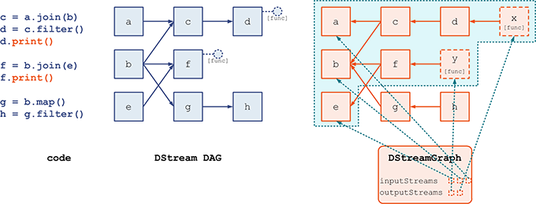
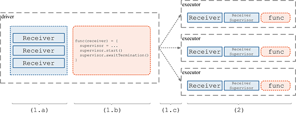
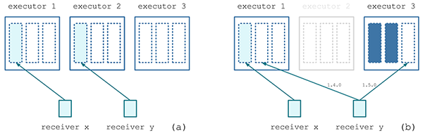
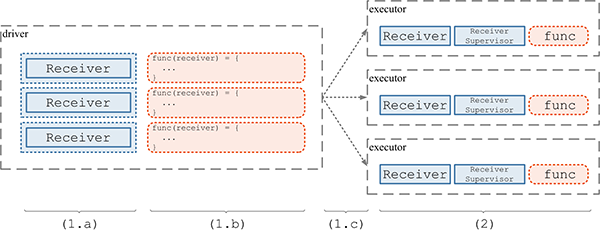

# Receiver 分发详解

***[酷玩 Spark] Spark Streaming 源码解析系列*** ，返回目录请 [猛戳这里](readme.md)

[「腾讯广告」](http://e.qq.com)技术团队（原腾讯广点通技术团队）荣誉出品

```
本系列内容适用范围：

* 2018.11.02 update, Spark 2.4 全系列 √ (已发布：2.4.0)
* 2018.02.28 update, Spark 2.3 全系列 √ (已发布：2.3.0 ~ 2.3.2)
* 2017.07.11 update, Spark 2.2 全系列 √ (已发布：2.2.0 ~ 2.2.3)
```
<br/>
<br/>

阅读本文前，请一定先阅读 [Spark Streaming 实现思路与模块概述](0.1 Spark Streaming 实现思路与模块概述.md) 一文，其中概述了 Spark Streaming 的 4 大模块的基本作用，有了全局概念后再看本文对 `模块 3：数据产生与导入` 细节的解释。

## 引言

我们前面在 [DStream, DStreamGraph 详解](1.1 DStream, DStreamGraph 详解.md) 讲到，整个 `DStreamGraph` 是由 `output stream` 通过 *dependency* 引用关系，索引到上游 `DStream` 节点。而递归的追溯到最上游的 `InputDStream` 节点时，就没有对其它 `DStream` 节点的依赖了，因为 `InputDStream` 节点本身就代表了最原始的数据集。



我们对 `模块 3：数据产生与导入` 细节的解释，是仅针对 `ReceiverInputDStream` 及其子类的；其它 `InputDStream` 子类的讲解，我们在另外的文章中进行。即，本模块的讨论范围是：

```scala
- ReceiverInputDStream
  - 子类 SocketInputDStream
  - 子类 TwitterInputDStream
  - 子类 RawInputDStream
  - 子类 FlumePollingInputDStream
  - 子类 MQTTInputDStream
  - 子类 FlumeInputDStream
  - 子类 PluggableInputDStream
  - 子类 KafkaInputDStream
```

## ReceiverTracker 分发 Receiver 过程

我们已经知道，`ReceiverTracker` 自身运行在 driver 端，是一个管理分布在各个 executor 上的 `Receiver` 的总指挥者。

在 `ssc.start()` 时，将隐含地调用 `ReceiverTracker.start()`；而 `ReceiverTracker.start()` 最重要的任务就是调用自己的 `launchReceivers()` 方法将 `Receiver` 分发到多个 executor 上去。然后在每个 executor 上，由 `ReceiverSupervisor` 来分别启动一个 `Receiver` 接收数据。这个过程用下图表示：


我们将以 1.4.0 和 1.5.0 这两个版本为代表，仔细分析一下 launchReceivers() 的实现。
  
    1.4.0 代表了 1.5.0 以前的版本，如 1.2.x, 1.3.x, 1.4.x
  
    1.5.0 代表了 1.5.0 以来的版本，如 1.5.x, 1.6.x

## Spark 1.4.0 的 launchReceivers() 实现

Spark 1.4.0 的 `launchReceivers()` 的过程如下：

- (1.a) **构造 Receiver RDD**。具体的，是先遍历所有的 `ReceiverInputStream`，获得将要启动的所有 `x` 个 `Receiver` 的实例。然后，把这些实例当做 `x` 份数据，在 driver 端构造一个 `RDD` 实例，这个 `RDD` 分为 `x` 个 partition，每个 partition 包含一个 `Receiver` 数据（即 `Receiver` 实例）。

- (1.b) **定义计算 func**。我们将在多个 executor 上共启动 `x` 个 `Task`，每个 `Task` 负责一个 partition 的数据，即一个 `Receiver` 实例。我们要对这个 `Receiver` 实例做的计算定义为 `func` 函数，具体的，`func` 是：
  - 以这个 `Receiver` 实例为参数，构造新的 `ReceiverSupervisor` 实例 `supervisor`：`supervisor = new ReceiverSupervisorImpl(receiver, ...)`
  - `supervisor.start()`；这一步将启动新线程启动 `Receiver` 实例，然后很快返回
  - `supervisor.awaitTermination()`；将一直 block 住当前 `Task` 的线程

- (1.c) **分发 RDD(Receiver) 和 func 到具体的 executor**。上面 (a)(b) 两步只是在 driver 端定义了 `RDD[Receiver]` 和 这个 `RDD` 之上将执行的 `func`，但并没有具体的去做。这一步是将两者的定义分发到 executor 上去，马上就可以实际执行了。

- (2) **在各个 executor 端，执行(1.b) 中定义的 `func`**。即启动 `Receiver` 实例，并一直 block 住当前线程。

这样，通过 1 个 `RDD` 实例包含 `x` 个 `Receiver`，对应启动 1 个 `Job` 包含 `x` 个 `Task`，就可以完成 `Receiver` 的分发和部署了。上述 (1.a)(1.b)(1.c)(2) 的过程示意如下图：



这里 Spark Streaming 下层的 Spark Core 对 `Receiver` 分发是毫无感知的，它只是执行了“应用层面” -- 对 Spark Core 来讲，Spark Streaming 就是“应用层面”-- 的一个普通 `Job`；但 Spark Streaming 只通过这个普通 `Job` 即可完“特殊功能”的 `Receiver` 分发，可谓巧妙巧妙。

上述逻辑实现的源码请到 [Spark 1.4.0 的 ReceiverTracker](https://github.com/apache/spark/blob/v1.4.0/streaming/src/main/scala/org/apache/spark/streaming/scheduler/ReceiverTracker.scala) 查看。

## Spark 1.5.0 的 launchReceivers() 实现

其实上面这个实现，这个长时运行的分发 `Job` 还存在一些问题：

- 如果某个 `Task` 失败超过 `spark.task.maxFailures(默认=4)` 次的话，整个 `Job` 就会失败。这个在长时运行的 Spark Streaming 程序里，`Executor` 多失效几次就有可能导致 `Task` 失败达到上限次数了。
- 如果某个 `Task` 失效一下，Spark Core 的 `TaskScheduler` 会将其重新部署到另一个 executor 上去重跑。但这里的问题在于，负责重跑的 executor 可能是在下发重跑的那一刻是正在执行 `Task` 数较少的，但不一定能够将 `Receiver` 分布的最均衡的。
- 有个用户 code 可能会想自定义一个 `Receiver` 的分布策略，比如所有的 `Receiver` 都部署到同一个节点上去。

从 1.5.0 开始，Spark Streaming 添加了增强的 `Receiver` 分发策略。对比之前的版本，主要的变更在于：

1. 添加可插拔的 `ReceiverSchedulingPolicy`
2. 把 `1` 个 `Job`（包含 `x` 个 `Task`），改为 `x` 个 `Job`（每个 `Job` 只包含 `1` 个 `Task`）
3. 添加对 `Receiver` 的监控重启机制

我们一个一个看一看。

### (1) 可插拔的 ReceiverSchedulingPolicy

`ReceiverSchedulingPolicy` 的主要目的，是在 Spark Streaming 层面添加对 `Receiver` 的分发目的地的计算，相对于之前版本依赖 Spark Core 的 `TaskScheduler` 进行通用分发，新的 `ReceiverSchedulingPolicy` 会对 Streaming 应用的更好的语义理解，也能计算出更好的分发策略。

`ReceiverSchedulingPolicy` 有两个方法，分别用于：

- 在 Streaming 程序首次启动时：
  - 收集所有 `InputDStream` 包含的所有 `Receiver` 实例 —— `receivers`
  - 收集所有的 executor —— `executors` —— 作为候选目的地
  - 然后就调用 `ReceiverSchedulingPolicy.scheduleReceivers(receivers, executors)` 来计算每个 `Receiver` 的目的地 executor 列表

- 在 Streaming 程序运行过程中，如果需要重启某个 `Receiver`：
  - 将首先看一看之前计算过的目的地 executor 有没有还 alive 的
  - 如果没有，就需要 `ReceiverSchedulingPolicy.rescheduleReceiver(receiver, ...)` 来重新计算这个 `Receiver` 的目的地 executor 列表

[默认的 `ReceiverSchedulingPolicy`](https://github.com/apache/spark/blob/master/streaming/src/main/scala/org/apache/spark/streaming/scheduler/ReceiverSchedulingPolicy.scala) 是实现为 `round-robin` 式的了。我们举例说明下这两个方法：



其中，在 `Receiver y` 失效时，以前的 Spark Streaming 有可能会在 executor 1 上重启 `Receiver y`，而 1.5.0 以来，将在 executor 3 上重启 `Receiver y`。

### (2) 每个 Receiver 分发有单独的 Job 负责

1.5.0 版本以来的 Spark Streaming，是为每个 `Receiver` 都分配单独的只有 1 个 `Task` 的 `Job` 来尝试分发，这与以前版本将 `x` 个 `Receiver` 都放到一个有 `x` 个 `Task` 的 `Job` 里分发是很不一样的。

而且，对于这仅有的一个 `Task`，只在第 1 次执行时，才尝试启动 `Receiver`；如果该 `Task` 因为失效而被调度到其它 executor 执行时，就不再尝试启动 `Receiver`、只做一个空操作，从而导致本 `Job` 的状态是成功执行已完成。`ReceiverTracker` 会另外调起一个 `Job` ——  有可能会重新计算 `Receiver` 的目的地 —— 来继续尝试 `Receiver` 分发……如此直到成功为止。

另外，由于 Spark Core 的 `Task` 下发时只会参考并大部分时候尊重 Spark Streaming 设置的 `preferredLocation` 目的地信息，还是有一定可能该分发 `Receiver` 的 `Job` 并没有在我们想要调度的 executor 上运行。此时，在第 1 次执行 `Task` 时，会首先向 `ReceiverTracker` 发送 `RegisterReceiver` 消息，只有得到肯定的答复时，才真正启动 `Receiver`，否则就继续做一个空操作，导致本 `Job` 的状态是成功执行已完成。当然，`ReceiverTracker` 也会另外调起一个 `Job`，来继续尝试 `Receiver` 分发……如此直到成功为止。

我们用图示来表达这个改动：



所以通过上面可以看到，一个 `Receiver` 的分发 `Job` 是有可能没有完成分发 `Receiver` 的目的的，所以 `ReceiverTracker` 会继续再起一个 `Job` 来尝试 `Receiver` 分发。这个机制保证了，如果一次 `Receiver` 如果没有抵达预先计算好的 executor，就有机会再次进行分发，从而实现在 Spark Streaming 层面对 `Receiver` 所在位置更好的控制。

### (3) 对 `Receiver` 的监控重启机制

上面分析了每个 `Receiver` 都有专门的 `Job` 来保证分发后，我们发现这样一来，`Receiver` 的失效重启就不受 `spark.task.maxFailures(默认=4)` 次的限制了。

因为现在的 `Receiver` 重试不是在 `Task` 级别，而是在 `Job` 级别；并且 `Receiver` 失效后并不会导致前一次 `Job` 失败，而是前一次 `Job` 成功、并新起一个 `Job` 再次进行分发。这样一来，不管 Spark Streaming 运行多长时间，`Receiver` 总是保持活性的，不会随着 executor 的丢失而导致 `Receiver` 死去。

## 总结

我们再简单对比一下 1.4.0 和 1.5.0 版本在 `Receiver` 分发上的区别：


通过以上分析，我们总结：

<table>
    <tr>
        <td align="center"></td>
        <td align="center"><strong>Spark Streaming 1.4.0</strong></td>
        <td align="center"><strong>Spark Streaming 1.5.0</strong></td>
    </tr>
    <tr>
        <td align="center"><strong>Receiver 活性</strong></td>
        <td align="center">不保证永活</td>
        <td align="center">无限重试、保证永活</td>
    </tr>
    <tr>
        <td align="center"><strong>Receiver 均衡分发</strong></td>
        <td align="center">无保证</td>
        <td align="center">round-robin 策略</td>
    </tr>
    <tr>
        <td align="center"><strong>自定义 Receiver 分发</strong></td>
        <td align="center">很 tricky</td>
        <td align="center">方便</td>
    </tr>
</table>

## 致谢

本文所分析的 1.5.0 以来增强的 `Receiver` 分发策略，是由朱诗雄同学强势贡献给社区的：

- 
- 朱诗雄，Apache Spark Committer, Databricks 的中国籍牛牛工程师，已为 Spark 持续贡献代码近两年时间
- 强势围观 [他的 Github](https://github.com/zsxwing)，和 [他正为 Spark 贡献的代码](https://github.com/apache/spark/commits/master?author=zsxwing)

<br/>
<br/>

（本文完，参与本文的讨论请 [猛戳这里](https://github.com/proflin/CoolplaySpark/issues/6)，返回目录请 [猛戳这里](readme.md)）
