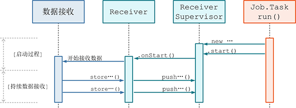
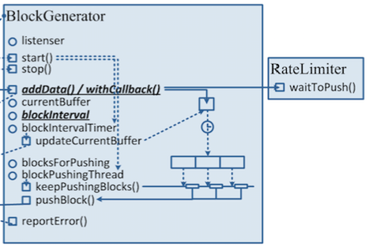

# Receiver, ReceiverSupervisor, BlockGenerator, ReceivedBlockHandler 详解

***[酷玩 Spark] Spark Streaming 源码解析系列*** ，返回目录请 [猛戳这里](readme.md)

[「腾讯广告」](http://e.qq.com)技术团队（原腾讯广点通技术团队）荣誉出品

```
本系列内容适用范围：

* 2018.11.02 update, Spark 2.4 全系列 √ (已发布：2.4.0)
* 2018.02.28 update, Spark 2.3 全系列 √ (已发布：2.3.0 ~ 2.3.2)
* 2017.07.11 update, Spark 2.2 全系列 √ (已发布：2.2.0 ~ 2.2.3)
```
<br/>
<br/>

阅读本文前，请一定先阅读 [Spark Streaming 实现思路与模块概述](0.1 Spark Streaming 实现思路与模块概述.md) 一文，其中概述了 Spark Streaming 的 4 大模块的基本作用，有了全局概念后再看本文对 `模块 3：数据产生与导入` 细节的解释。

## 引言

我们在前面 [Spark Streaming 实现思路与模块概述](0.1 Spark Streaming 实现思路与模块概述.md) 中分析过，Spark Streaming 在程序刚开始运行时：

- (1) 由 `Receiver` 的总指挥 `ReceiverTracker` 分发多个 job（每个 job 有 1 个 task），到多个 executor 上分别启动 `ReceiverSupervisor` 实例；

- (2) 每个 `ReceiverSupervisor` 启动后将马上生成一个用户提供的 `Receiver` 实现的实例 —— 该 `Receiver` 实现可以持续产生或者持续接收系统外数据，比如 `TwitterReceiver` 可以实时爬取 twitter 数据 —— 并在 `Receiver` 实例生成后调用 `Receiver.onStart()`。


    ReceiverSupervisor 的全限定名是：org.apache.spark.streaming.receiver.ReceiverSupervisor
    Receiver           的全限定名是：org.apache.spark.streaming.receiver.Receiver

(1)(2) 的过程由上图所示，这时 `Receiver` 启动工作已运行完毕。

接下来 `ReceiverSupervisor` 将在 executor 端作为的主要角色，并且：

- (3) `Receiver` 在 `onStart()` 启动后，就将**持续不断**地接收外界数据，并持续交给 `ReceiverSupervisor` 进行数据转储；

- (4) `ReceiverSupervisor` **持续不断**地接收到 `Receiver` 转来的数据：

	- 如果数据很细小，就需要 `BlockGenerator` 攒多条数据成一块(4a)、然后再成块存储(4b 或 4c)
	- 反之就不用攒，直接成块存储(4b 或 4c)
  
	- 这里 Spark Streaming 目前支持两种成块存储方式，一种是由 `blockManagerskManagerBasedBlockHandler` 直接存到 executor 的内存或硬盘，另一种由 `WriteAheadLogBasedBlockHandler` 是同时写 WAL(4c) 和 executor 的内存或硬盘

- (5) 每次成块在 executor 存储完毕后，`ReceiverSupervisor` 就会及时上报块数据的 meta 信息给 driver 端的 `ReceiverTracker`；这里的 meta 信息包括数据的标识 id，数据的位置，数据的条数，数据的大小等信息。

- (6) `ReceiverTracker` 再将收到的块数据 meta 信息直接转给自己的成员 `ReceivedBlockTracker`，由 `ReceivedBlockTracker` 专门管理收到的块数据 meta 信息。


    BlockGenerator                 的全限定名是：org.apache.spark.streaming.receiver.BlockGenerator
    BlockManagerBasedBlockHandler  的全限定名是：org.apache.spark.streaming.receiver.BlockManagerBasedBlockHandler
    WriteAheadLogBasedBlockHandler 的全限定名是：org.apache.spark.streaming.receiver.WriteAheadLogBasedBlockHandler
    ReceivedBlockTracker           的全限定名是：org.apache.spark.streaming.scheduler.ReceivedBlockTracker
    ReceiverInputDStream           的全限定名是：org.apache.spark.streaming.dstream.ReceiverInputDStream

这里 (3)(4)(5)(6) 的过程是一直**持续不断**地发生的，我们也将其在上图里标识出来。

后续在 driver 端，就由 `ReceiverInputDStream` 在每个 batch 去检查 `ReceiverTracker` 收到的块数据 meta 信息，界定哪些新数据需要在本 batch 内处理，然后生成相应的 `RDD` 实例去处理这些块数据。

下面我们来详解 Receiver, ReceiverSupervisor, BlockGenerator 这三个类。

## Receiver 详解

`Receiver` 是一个 abstract 的基类：

```scala
// 来自 Receiver

abstract class Receiver[T](val storageLevel: StorageLevel) extends Serializable {
  // 需要子类实现
  def onStart()
  def onStop()
  
  // 基类实现，供子类调用
  def store(dataItem: T) {...}                  // 【存储单条小数据】
  def store(dataBuffer: ArrayBuffer[T]) {...}   // 【存储数组形式的块数据】
  def store(dataIterator: Iterator[T]) {...}    // 【存储 iterator 形式的块数据】
  def store(bytes: ByteBuffer) {...}            // 【存储 ByteBuffer 形式的块数据】
  
  ...
}
```

这里需要 `Receiver` 子类具体实现的是，`onStart()` 和 `onStop()` 方法。`onStart()` 是在 executor 端被 `ReceiverSupervisor` 调用的，而且 `onStart()` 的实现应该很快就能返回，不要写成阻塞式的。

比如，Spark Streaming 自带的 `SocketReceiver` 的 `onStart()` 实现如下：

```scala
// 来自 SocketReceiver

def onStart() {
  new Thread("Socket Receiver") {
    setDaemon(true)
    override def run() { receive() }
  }.start()  // 【仅新拉起了一个线程来接收数据】
  // 【onStart() 方法很快就返回了】
}
```

另外的 `onStop()` 实现，就是在 `Receiver` 被关闭时调用了，可以做一些 close 工作。

我们看当 `Receiver` 真正启动起来后，可以开始产生或者接收数据了，那接收到的数据该怎么存到 Spark Streaming 里？

答案很简单，就是直接调用 `store()` 方法即可。`Receiver` 基类提供了 4 种签名的 `store()` 方法，分别可用于存储：
- (a) 单条小数据
- (b) 数组形式的块数据
- (c) iterator 形式的块数据
- (d) ByteBuffer 形式的块数据

这 4 种签名的 `store()` 的实现都是直接将数据转给 `ReceiverSupervisor`，由 `ReceiverSupervisor` 来具体负责存储。

所以，一个具体的 `Receiver` 子类实现，只要在 `onStart()` 里新拉起数据接收线程，并在接收到数据时 `store()` 到 Spark Streamimg 框架就可以了。

## ReceiverSupervisor 详解

我们在 [Receiver 分发详解](3.1 Receiver 分发详解.md) 里分析过，在 executor 端，分发 `Receiver` 的 `Job` 的 `Task` 执行的实现是：

```scala
(iterator: Iterator[Receiver[_]]) => {
  ...
  val receiver = iterator.next()
  assert(iterator.hasNext == false)
  // 【ReceiverSupervisor 的具体实现 ReceiverSupervisorImpl】
  val supervisor = new ReceiverSupervisorImpl(receiver, ...)
  supervisor.start()
  supervisor.awaitTermination()
  ...
}
```

`ReceiverSupervisor` 定义了一些方法接口，其具体的实现类是 `ReceiverSupervisorImpl`。

我们看到在上面的代码中，executor 端会先 `new` 一个 `ReceiverSupervisorImpl`，然后 `ReceiverSupervisorImpl.start()`。这里 `.start()` 很重要的工作就是调用 `Receiver.onStart()`，来启动 `Receiver` 的数据接收线程：



`start()` 成功后，`ReceiverSurpervisorImpl` 最重要的工作就是接收 `Receiver` 给 `store()` 过来的数据了。

`ReceiverSurpervisorImpl` 有 4 种签名的 `push()` 方法，被 `Receiver` 的 4 种 `store()` 一一调用。不过接下来对单条小数据和三种块数据的处理稍有区别。

单条的情况，`ReceiverSupervisorImpl` 要在 `BlockGenerator` 的协助下，将多个单条的数据积攒为一个块数据，然后重新调用 `push` 交给 `ReceiverSurpervisorImpl` 来处理这个块数据。我们一会再详解 `BlockGenerator` 的这个过程。

所以接下来，我们主要看这 3 个存储块数据的 `push...()` 方法，它们的实现非常简单：

```scala
// 来自 ReceiverSupervisorImpl

def pushArrayBuffer(arrayBuffer: ArrayBuffer[_], ...) {
  pushAndReportBlock(ArrayBufferBlock(...), ...)
}

def pushIterator(iterator: Iterator[_], ...) {
  pushAndReportBlock(IteratorBlock(...), ...)
}

def pushBytes(bytes: ByteBuffer, ...){
  pushAndReportBlock(ByteBufferBlock(...), ...)
}

def pushAndReportBlock(receivedBlock: ReceivedBlock, ...) {
...
}
```

顾名思义，这 3 个存储块数据的 `push...()` 方法即是将自己的数据统一包装为 `ReceivedBlock`，然后由 `pushAndReportBlock()` 做两件事情：

- (a) push：将 `ReceivedBlock` 交给 `ReceivedBlockHandler` 来存储，具体的，可以在 `ReceivedBlockHandler`  的两种存储实现里二选一
- (b) report：将已存储好的 `ReceivedBlock` 的块数据 meta 信息报告给 `ReceiverTracker`

上面的过程可以总结为：


## ReceivedBlockHandler 详解

`ReceivedBlockHandler` 是一个接口类，在 executor 端负责对接收到的块数据进行具体的存储和清理：

```scala
// 来自 ReceivedBlockHandler

private[streaming] trait ReceivedBlockHandler {

  /** Store a received block with the given block id and return related metadata */
  def storeBlock(blockId: StreamBlockId, receivedBlock: ReceivedBlock): ReceivedBlockStoreResult

  /** Cleanup old blocks older than the given threshold time */
  def cleanupOldBlocks(threshTime: Long)
}
```

`ReceivedBlockHandler` 有两个具体的存储策略的实现：

- (a) `BlockManagerBasedBlockHandler`，是直接存到 executor 的内存或硬盘
- (b) `WriteAheadLogBasedBlockHandler`，是先写 WAL，再存储到 executor 的内存或硬盘

### (a) BlockManagerBasedBlockHandler 实现

`BlockManagerBasedBlockHandler` 主要是直接存储到 Spark Core 里的 `BlockManager` 里。

`BlockManager` 将在 executor 端接收 `Block` 数据，而在 driver 端维护 `Block` 的 meta 信息。 `BlockManager` 根据存储者的 `StorageLevel` 要求来存到本 executor 的 `RAM` 或者 `DISK`，也可以同时再额外复制一份到其它 executor 的 `RAM` 或者 `DISK`。[点这里](http://spark.apache.org/docs/latest/programming-guide.html#rdd-persistence)查看 `StorageLevel` 支持的所有枚举值。

下面是 `BlockManagerBasedBlockHandler.store()` 向 `BlockManager` 存储 3 种块数据的具体实现：
```scala
// 来自 BlockManagerBasedBlockHandler

def storeBlock(blockId: StreamBlockId, block: ReceivedBlock): ReceivedBlockStoreResult = {
  val putResult: Seq[(BlockId, BlockStatus)] = block match {
    case ArrayBufferBlock(arrayBuffer) =>
      blockManager.putIterator(blockId, arrayBuffer.iterator, ...)   // 【存储数组到 blockManager 里】
    case IteratorBlock(iterator) =>
      blockManager.putIterator(blockId, countIterator, ...)          // 【存储 iterator 到 blockManager 里】
    case ByteBufferBlock(byteBuffer) =>
      blockManager.putBytes(blockId, byteBuffer, ...)                // 【存储 ByteBuffer 到 blockManager 里】
  ...
}
```

### (b) WriteAheadLogBasedBlockHandler 实现

`WriteAheadLogBasedBlockHandler` 的实现则是同时写到可靠存储的 WAL 中和 executor 的 `BlockManager` 中；在两者都写完成后，再上报块数据的 meta 信息。

`BlockManager` 中的块数据是计算时首选使用的，只有在 executor 失效时，才去 WAL 中读取写入过的数据。

同其它系统的 WAL 一样，数据是完全顺序地写入 WAL 的；在稍后上报块数据的 meta 信息，就额外包含了块数据所在的 WAL 的路径，及在 WAL 文件内的偏移地址和长度。

具体的写入逻辑如下：

```scala
// 来自 WriteAheadLogBasedBlockHandler

def storeBlock(blockId: StreamBlockId, block: ReceivedBlock): ReceivedBlockStoreResult = {
  ...
  // 【生成向 BlockManager 存储数据的 future】
  val storeInBlockManagerFuture = Future {
    val putResult =
      blockManager.putBytes(blockId, serializedBlock, effectiveStorageLevel, tellMaster = true)
    if (!putResult.map { _._1 }.contains(blockId)) {
      throw new SparkException(
        s"Could not store $blockId to block manager with storage level $storageLevel")
    }
  }

  // 【生成向 WAL 存储数据的 future】
  val storeInWriteAheadLogFuture = Future {
    writeAheadLog.write(serializedBlock, clock.getTimeMillis())
  }

  // 【开始执行两个 future、等待两个 future 都结束】
  val combinedFuture = storeInBlockManagerFuture.zip(storeInWriteAheadLogFuture).map(_._2)
  val walRecordHandle = Await.result(combinedFuture, blockStoreTimeout)
  
  // 【返回存储结果，用于后续的块数据 meta 上报】
  WriteAheadLogBasedStoreResult(blockId, numRecords, walRecordHandle)
}
```

## BlockGenerator 详解

最后我们来补充一下 `ReceiverSupervisorImpl` 在收到单块条小数据后，委托 `BlockGenerator` 进行积攒，并封装多条小数据为一整个块数据的详细过程。

`BlockGenerator` 在内部主要是维护一个临时的变长数组 `currentBuffer`，每收到一条 `ReceiverSupervisorImpl` 转发来的数据就加入到这个 `currentBuffer` 数组中。

这里非常需要注意的地方，就是在加入 `currentBuffer` 数组时会先由 `rateLimiter` 检查一下速率，是否加入的频率已经太高。如果太高的话，就需要 block 住，等到下一秒再开始添加。这里的最高频率是由 `spark.streaming.receiver.maxRate (default = Long.MaxValue)` 控制的，是单个 `Receiver` 每秒钟允许添加的条数。控制了这个速率，就控制了整个 Spark Streaming 系统每个 batch 需要处理的最大数据量。之前版本的 Spark Streaming 是静态设置了这样的一个上限并由所有 `Receiver` 统一遵守；但在 1.5.0 以来，Spark Streaming 加入了分别动态控制每个 `Receiver` 速率的特性，这个我们会单独有一篇文章介绍。

然后会维护一个定时器，每隔 `blockInterval` 的时间就生成一个新的空变长数组替换老的数组作为新的 `currentBuffer` ，并把老的数组加入到一个自己的一个 `blocksForPushing` 的队列里。

这个 `blocksForPushing` 队列实际上是一个 `ArrayBlockingQueue`，大小由 `spark.streaming.blockQueueSize（默认 = 10）` 来控制。然后就有另外的一个线程专门从这个队列里取出来已经包装好的块数据，然后调用 `ReceiverSupervisorImpl.pushArrayBuffer(...)` 来将块数据交回给 `ReceiverSupervisorImpl`。

`BlockGenerator` 工作的整个过程示意图如下：

 *//TODO(lwlin): 此图风格与本系列文章不符，需要美化*

## 总结

总结我们在本文所做的详解 —— `ReceiverSupervisor` 将在 executor 端作为的主要角色，并且：

- (3) `Receiver` 在 `onStart()` 启动后，就将**持续不断**地接收外界数据，并持续交给 `ReceiverSupervisor` 进行数据转储；

- (4) `ReceiverSupervisor` **持续不断**地接收到 `Receiver` 转来的数据：

	- 如果数据很细小，就需要 `BlockGenerator` 攒多条数据成一块(4a)、然后再成块存储(4b 或 4c)
	- 反之就不用攒，直接成块存储(4b 或 4c)
  
	- 这里 Spark Streaming 目前支持两种成块存储方式，一种是由 `blockManagerskManagerBasedBlockHandler` 直接存到 executor 的内存或硬盘，另一种由 `WriteAheadLogBasedBlockHandler` 是同时写 WAL(4c) 和 executor 的内存或硬盘

- (5) 每次成块在 executor 存储完毕后，`ReceiverSupervisor` 就会及时上报块数据的 meta 信息给 driver 端的 `ReceiverTracker`；这里的 meta 信息包括数据的标识 id，数据的位置，数据的条数，数据的大小等信息。

- (6) `ReceiverTracker` 再将收到的块数据 meta 信息直接转给自己的成员 `ReceivedBlockTracker`，由 `ReceivedBlockTracker` 专门管理收到的块数据 meta 信息。


<br/>
<br/>

（本文完，参与本文的讨论请 [猛戳这里](https://github.com/proflin/CoolplaySpark/issues/7)，返回目录请 [猛戳这里](readme.md)）
