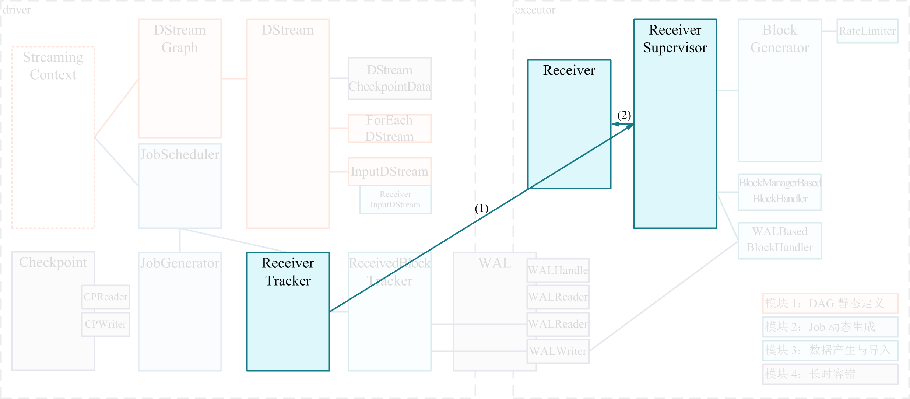
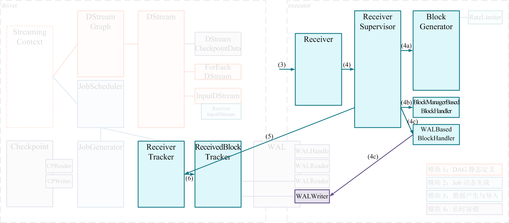
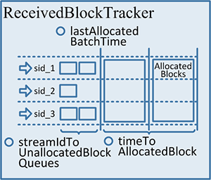
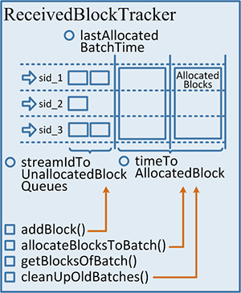

# ReceiverTraker, ReceivedBlockTracker 详解

***[酷玩 Spark] Spark Streaming 源码解析系列*** ，返回目录请 [猛戳这里](readme.md)

[「腾讯广告」](http://e.qq.com)技术团队（原腾讯广点通技术团队）荣誉出品

```
本系列内容适用范围：

* 2018.11.02 update, Spark 2.4 全系列 √ (已发布：2.4.0)
* 2018.02.28 update, Spark 2.3 全系列 √ (已发布：2.3.0 ~ 2.3.2)
* 2017.07.11 update, Spark 2.2 全系列 √ (已发布：2.2.0 ~ 2.2.3)
```
<br/>
<br/>

阅读本文前，请一定先阅读 [Spark Streaming 实现思路与模块概述](0.1 Spark Streaming 实现思路与模块概述.md) 一文，其中概述了 Spark Streaming 的 4 大模块的基本作用，有了全局概念后再看本文对 `模块 3：数据产生与导入` 细节的解释。

## 引言

我们在 [Spark Streaming 实现思路与模块概述](0.1 Spark Streaming 实现思路与模块概述.md) 给出了 `模块 3：数据产生与导入` 的基本工作流程：

- (1) 由 `Receiver` 的总指挥 `ReceiverTracker` 分发多个 job（每个 job 有 1 个 task），到多个 executor 上分别启动 `ReceiverSupervisor` 实例；

- (2) 每个 `ReceiverSupervisor` 启动后将马上生成一个用户提供的 `Receiver` 实现的实例 —— 该 `Receiver` 实现可以持续产生或者持续接收系统外数据，比如 `TwitterReceiver` 可以实时爬取 twitter 数据 —— 并在 `Receiver` 实例生成后调用 `Receiver.onStart()`。



(1)(2) 的过程由上图所示，这时 `Receiver` 启动工作已运行完毕。

接下来 `ReceiverSupervisor` 将在 executor 端作为的主要角色，并且：

- (3) `Receiver` 在 `onStart()` 启动后，就将**持续不断**地接收外界数据，并持续交给 `ReceiverSupervisor` 进行数据转储；

- (4) `ReceiverSupervisor` **持续不断**地接收到 `Receiver` 转来的数据：

	- 如果数据很细小，就需要 `BlockGenerator` 攒多条数据成一块(4a)、然后再成块存储(4b 或 4c)
	- 反之就不用攒，直接成块存储(4b 或 4c)
  
	- 这里 Spark Streaming 目前支持两种成块存储方式，一种是由 `blockManagerskManagerBasedBlockHandler` 直接存到 executor 的内存或硬盘，另一种由 `WriteAheadLogBasedBlockHandler` 是同时写 WAL(4c) 和 executor 的内存或硬盘

- (5) 每次成块在 executor 存储完毕后，`ReceiverSupervisor` 就会及时上报块数据的 meta 信息给 driver 端的 `ReceiverTracker`；这里的 meta 信息包括数据的标识 id，数据的位置，数据的条数，数据的大小等信息。

- (6) `ReceiverTracker` 再将收到的块数据 meta 信息直接转给自己的成员 `ReceivedBlockTracker`，由 `ReceivedBlockTracker` 专门管理收到的块数据 meta 信息。



这里 (3)(4)(5)(6) 的过程是一直**持续不断**地发生的，我们也将其在上图里标识出来。

上面的内容我们已经在 [Receiver 分发详解](3.1 Receiver 分发详解.md) 和 [Receiver, ReceiverSupervisor, BlockGenerator, ReceivedBlockHandler 详解](3.2 Receiver, ReceiverSupervisor, BlockGenerator, ReceivedBlockHandler 详解.md) 中介绍过了。

本文我们详解的是 driver 端的 `ReceiverTracker` 和 `ReceivedBlockTracker`

    ReceiverTracker      的全限定名是：org.apache.spark.streaming.scheduler.ReceiverTracker
    ReceivedBlockTracker 的全限定名是：org.apache.spark.streaming.scheduler.ReceivedBlockTracker

## ReceiverTracker 详解

`ReceiverTracker` 在 Spark 1.5.0 版本里的代码变动比较大，不过其主要功能还是没怎么改变，我们一一来看：

- (1) `ReceiverTracker` 分发和监控 `Receiver`
	- `ReceiverTracker` 负责 `Receiver` 在各个 executor 上的分发
	- 包括 `Receiver` 的失败重启
- (2) `ReceiverTracker` 作为 `RpcEndpoint`
	- `ReceiverTracker` 作为 `Receiver` 的管理者，是各个 `Receiver` 上报信息的入口
	- 也是 driver 下达管理命令到 `Receiver` 的出口
- (3) `ReceiverTracker` 管理已上报的块数据 meta 信息

整体来看，`ReceiverTracker` 就是 `Receiver` 相关信息的中枢。

### (1) ReceiverTracker 分发和监控 Receiver

`ReceiverTracker` 分发和监控 `Receiver` 的内容我们已经在 [Receiver 分发详解.md](3.1 Receiver 分发详解.md) 详解过了，我们这里总结一下。

在 `ssc.start()` 时，将隐含地调用 `ReceiverTracker.start()`；而 `ReceiverTracker.start()` 最重要的任务就是调用自己的 `launchReceivers()` 方法将 `Receiver` 分发到多个 executor 上去。然后在每个 executor 上，由 `ReceiverSupervisor` 来分别启动一个 `Receiver` 接收数据。这个过程用下图表示：


而且在 1.5.0 版本以来引入了 `ReceiverSchedulingPolicy`，是在 Spark Streaming 层面添加对 `Receiver` 的分发目的地的计算，相对于之前版本依赖 Spark Core 的 `TaskScheduler` 进行通用分发，新的 `ReceiverSchedulingPolicy` 会对 Streaming 应用的更好的语义理解，也能计算出更好的分发策略。

并且还通过每个 `Receiver` 对应 `1` 个 `Job` 的方式，保证了 `Receiver` 的多次分发，和失效后的重启、永活。

从本小节 `ReceiverTracker` 分发和监控 `Receiver` 的角度，我们对以前版本的 Spark Streaming(以 1.4.0 为代表)、和新版本的 Spark Streaming(以 1.5.0 为代表)有总结对比：

<table>
    <tr>
        <td align="center"></td>
        <td align="center"><strong>Spark Streaming 1.4.0</strong></td>
        <td align="center"><strong>Spark Streaming 1.5.0</strong></td>
    </tr>
    <tr>
        <td align="center"><strong>Receiver 活性</strong></td>
        <td align="center">不保证永活</td>
        <td align="center">无限重试、保证永活</td>
    </tr>
    <tr>
        <td align="center"><strong>Receiver 均衡分发</strong></td>
        <td align="center">无保证</td>
        <td align="center">round-robin 策略</td>
    </tr>
    <tr>
        <td align="center"><strong>自定义 Receiver 分发</strong></td>
        <td align="center">很 tricky</td>
        <td align="center">方便</td>
    </tr>
</table>

### (2) ReceiverTracker 作为 RpcEndpoint

`RpcEndPoint` 可以理解为 RPC 的 server 端，供 client 调用。

`ReceiverTracker` 作为 `RpcEndPoint` 的地址 —— 即 driver 的地址 —— 是公开的，可供 `Receiver` 连接；如果某个 `Receiver` 连接成功，那么 `ReceiverTracker` 也就持有了这个 `Receiver` 的 `RpcEndPoint`。这样一来，通过发送消息，就可以实现双向通信。

1.5.0 版本以来，`ReceiverTracker` 支持的消息有 10 种，我们进行一个总结：

<table>
    <tr>
    	<td>StopAllReceivers 消息</td>
        <td>消息</td>
        <td>解释</td>
    </tr>
    <tr>
        <td rowspan="5">ReceiverTracker<br/>只接收、不回复</td>
        <td>StartAllReceivers 消息</td>
        <td>在 ReceiverTracker 刚启动时，发给自己这个消息，触发具体的 schedulingPolicy 计算，和后续分发</td>
    </tr>
    <tr>
        <td>RestartReceiver 消息</td>
        <td>当初始分发的 executor 不对，或者 Receiver 失效等情况出现，发给自己这个消息，触发 Receiver 重新分发</td>
    </tr>
    <tr>
        <td>CleanupOldBlocks 消息</td>
        <td>当块数据已完成计算不再需要时，发给自己这个消息，将给所有的 Receiver 转发此 CleanupOldBlocks 消息</td>
    </tr>
    <tr>
        <td>UpdateReceiverRateLimit 消息</td>
        <td>ReceiverTracker 动态计算出某个 Receiver 新的 rate limit，将给具体的 Receiver 发送 UpdateRateLimit 消息</td>
    </tr>
    <tr>
        <td>ReportError 消息</td>
        <td>是由 Receiver 上报上来的，将触发 reportError() 方法向 listenerBus 扩散此 error 消息 </td>
    </tr>
    <tr>
        <td rowspan="5">ReceiverTracker<br/>接收并回复</td>
        <td>RegisterReceiver 消息</td>
        <td>由 Receiver 在试图启动的过程中发来，将回复允许启动，或不允许启动</td>
    </tr>
    <tr>
        <td>AddBlock 消息</td>
        <td>具体的块数据 meta 上报消息，由 Receiver 发来，将返回成功或失败</td>
    </tr>
    <tr>
        <td>DeregisterReceiver 消息</td>
        <td>由 Receiver 发来，处理后，无论如何都返回 true</td>
    </tr>
    <tr>
        <td>AllReceiverIds 消息</td>
        <td>在 ReceiverTracker stop() 的过程中，查询是否还有活跃的 Receiver</td>
    </tr>
    <tr>
        <td>StopAllReceivers 消息</td>
        <td>在 ReceiverTracker stop() 的过程刚开始时，要求 stop 所有的 Receiver；将向所有的 Receiver 发送 stop 信息</td>
    </tr>
</table>

### (3) ReceiverTracker 管理块数据的 meta 信息

一方面 `Receiver` 将通过 `AddBlock` 消息上报 meta 信息给 `ReceiverTracker`，另一方面 `JobGenerator` 将在每个 batch 开始时要求 `ReceiverTracker` 将已上报的块信息进行 batch 划分，`ReceiverTracker` 完成了块数据的 meta 信息管理工作。

具体的，`ReceiverTracker` 有一个成员 `ReceivedBlockTracker`，专门负责已上报的块数据 meta 信息管理。

## ReceivedBlockTracker 详解

我们刚刚讲到，`ReceivedBlockTracker` 专门负责已上报的块数据 meta 信息管理，但 `ReceivedBlockTracker` 本身不负责对外交互，一切都是通过 `ReceiverTracker` 来转发 —— 这里 `ReceiverTracker` 相当于是 `ReceivedBlockTracker` 的门面（可参考 [门面模式](http://www.cnblogs.com/zhenyulu/articles/55992.html)）。

在 `ReceivedBlockTracker` 内部，有几个重要的成员，它们的关系如下：

 *//TODO(lwlin): 此图风格与本系列文章不符，需要美化*


- `streamIdToUnallocatedBlockQueues`
	- 维护了上报上来的、但尚未分配入 batch 的 `Block` 块数据的 meta
	- 为每个 `Receiver` 单独维护一个 queue，所以是一个 `HashMap：receiverId → mutable.Queue[ReceivedBlockInfo]`
- `timeToAllocatedBlocks`
	- 维护了上报上来的、已分配入 batch 的 `Block` 块数据的 meta
	- 按照 batch 进行一级索引、再按照 `receiverId` 进行二级索引的 queue，所以是一个 `HashMap: time → HashMap`
- `lastAllocatedBatchTime`
	- 记录了最近一个分配完成的 batch 是哪个

上面是用于状态记录的主要数据结构。对这些状态存取主要是 4 个方法：

- `addBlock(receivedBlockInfo: ReceivedBlockInfo)`
	- 收到某个 `Receiver` 上报上来的块数据 meta 信息，将其加入到 `streamIdToUnallocatedBlockQueues` 里
- `allocateBlocksToBatch(batchTime: Time)`
	- 主要是 `JobGenerator` 在发起新 batch 的计算时，第一步就调用本方法
	- 是将 `streamIdToUnallocatedBlockQueues` 的内容，以传入的 `batchTime` 参数为 key，添加到 `timeToAllocatedBlocks` 里
	- 并更新 `lastAllocatedBatchTime`
- `getBlocksOfBatch(batchTime: Time)`
	- 主要是 `JobGenerator` 在发起新 batch 的计算时，由 `DStreamGraph` 生成 RDD DAG 实例时，将调用本方法
	- 调用本方法查 `timeToAllocatedBlocks`，获得划入本 batch 的块数据元信息，由此生成处理对应块数据的 RDD
- `cleanupOldBatches(cleanupThreshTime: Time, ...)`
	- 主要是当一个 batch 已经计算完成、可以把已追踪的块数据的 meta 信息清理掉时调用
	- 将清理 `timeToAllocatedBlocks` 表里对应 `cleanupThreshTime` 之前的所有 batch 块数据 meta 信息

这 4 个方法，和对应信息状态的修改关系如下图总结：

 *//TODO(lwlin): 此图风格与本系列文章不符，需要美化*

上面即是 `ReceivedBlockTracker` 的主体内容。

但我们还需要强调一点非常重要的内容，即 `ReceivedBlockTracker` 需要对 driver 进行容错保障。也就是，如果 driver 失效，新起来的 driver 必须能够通过 WAL 恢复出失效前的  `ReceivedBlockTracker` 状态，具体的就需要包括 `streamIdToUnallocatedBlockQueues`, `timeToAllocatedBlocks`, `lastAllocatedBatchTime` 等内容，也即需要前面讲的 4 个方法在修改 `ReceivedBlockTracker` 的状态信息的时候，要首先写入 WAL，才能在失效后从 WAL 恢复出相关信息。

有关 WAL 写入和故障恢复的内容，我们将在 `模块 4：长时容错` 里系统性的详解。

## 总结

本文主要详解了 driver 端的 `Receiver` 管理者 —— `ReceiverTracker` —— 的主要功能：

- (1) `ReceiverTracker` 分发和监控 `Receiver`
	- `ReceiverTracker` 负责 `Receiver` 在各个 executor 上的分发
	- 包括 `Receiver` 的失败重启
- (2) `ReceiverTracker` 作为 `RpcEndpoint`
	- `ReceiverTracker` 作为 `Receiver` 的管理者，是各个 `Receiver` 上报信息的入口
	- 也是 driver 下达管理命令到 `Receiver` 的出口
- (3) `ReceiverTracker` 管理已上报的块数据 meta 信息
	- 委托给自己的成员 `ReceivedBlockManager` 进行具体管理

<br/>
<br/>

（本文完，参与本文的讨论请 [猛戳这里](https://github.com/proflin/CoolplaySpark/issues/8)，返回目录请 [猛戳这里](readme.md)）
