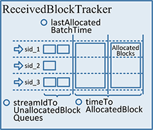

## Driver 端长时容错详解

***[酷玩 Spark] Spark Streaming 源码解析系列*** ，返回目录请 [猛戳这里](readme.md)

[「腾讯广告」](http://e.qq.com)技术团队（原腾讯广点通技术团队）荣誉出品

```
本系列内容适用范围：

* 2018.11.02 update, Spark 2.4 全系列 √ (已发布：2.4.0)
* 2018.02.28 update, Spark 2.3 全系列 √ (已发布：2.3.0 ~ 2.3.2)
* 2017.07.11 update, Spark 2.2 全系列 √ (已发布：2.2.0 ~ 2.2.3)
```
<br/>
<br/>

阅读本文前，请一定先阅读 [Spark Streaming 实现思路与模块概述](0.1 Spark Streaming 实现思路与模块概述.md) 一文，其中概述了 Spark Streaming 的 4 大模块的基本作用，有了全局概念后再看本文对 `模块 4：长时容错` 细节的解释。

## 引言

之前的详解我们详解了完成 Spark Streamimg 基于 Spark Core 所新增功能的 3 个模块，接下来我们看一看第 4 个模块将如何保障 Spark Streaming 的长时运行 —— 也就是，如何与前 3 个模块结合，保障前 3 个模块的长时运行。

通过前 3 个模块的关键类的分析，我们可以知道，保障模块 1 和 2 需要在 driver 端完成，保障模块 3 需要在 executor 端和 driver 端完成。


本文我们详解 driver 端的保障。具体的，包括两部分：

- (1) ReceivedBlockTracker 容错
  - 采用 WAL 冷备方式
- (2) DStream, JobGenerator 容错
  - 采用 Checkpoint 冷备方式

## (1)  ReceivedBlockTracker 容错详解

前面我们讲过，块数据的 meta 信息上报到 `ReceiverTracker`，然后交给 `ReceivedBlockTracker` 做具体的管理。`ReceivedBlockTracker` 也采用 WAL 冷备方式进行备份，在 driver 失效后，由新的 `ReceivedBlockTracker` 读取 WAL 并恢复 block 的 meta 信息。

`WriteAheadLog` 的方式在单机 RDBMS、NoSQL/NewSQL 中都有广泛应用，前者比如记录 transaction log 时，后者比如 HBase 插入数据可以先写到 HLog 里。

`WriteAheadLog` 的特点是顺序写入，所以在做数据备份时效率较高，但在需要恢复数据时又需要顺序读取，所以需要一定 recovery time。

`WriteAheadLog` 及其基于 rolling file 的实现 `FileBasedWriteAheadLog` 我们在 [Executor 端长时容错详解](4.1 Executor 端长时容错详解.md) 详解过了，下面我们主要看 `ReceivedBlockTracker` 如何使用 WAL。

`ReceivedBlockTracker` 里有一个 `writeToLog()` 方法，会将具体的 log 信息写到 rolling log 里。我们看代码有哪些地方用到了 `writeToLog()`：

```scala

def addBlock(receivedBlockInfo: ReceivedBlockInfo): Boolean = synchronized {
  ...
  // 【在收到了 Receiver 报上来的 meta 信息后，先通过 writeToLog() 写到 WAL】
  writeToLog(BlockAdditionEvent(receivedBlockInfo))
  // 【再将 meta 信息索引起来】
  getReceivedBlockQueue(receivedBlockInfo.streamId) += receivedBlockInfo
  ...
}

def allocateBlocksToBatch(batchTime: Time): Unit = synchronized {
  ...
  // 【在收到了 JobGenerator 的为最新的 batch 划分 meta 信息的要求后，先通过 writeToLog() 写到 WAL】
  writeToLog(BatchAllocationEvent(batchTime, allocatedBlocks))
  // 【再将 meta 信息划分到最新的 batch 里】
  timeToAllocatedBlocks(batchTime) = allocatedBlocks
  ...
}

def cleanupOldBatches(cleanupThreshTime: Time, waitForCompletion: Boolean): Unit = synchronized {
  ...
  // 【在收到了 JobGenerator 的清除过时的 meta 信息要求后，先通过 writeToLog() 写到 WAL】
  writeToLog(BatchCleanupEvent(timesToCleanup))
  // 【再将过时的 meta 信息清理掉】
  timeToAllocatedBlocks --= timesToCleanup
  // 【再将 WAL 里过时的 meta 信息对应的 log 清理掉】
  writeAheadLogOption.foreach(_.clean(cleanupThreshTime.milliseconds, waitForCompletion))
}
```

通过上面的代码可以看到，有 3 种消息 —— `BlockAdditionEvent`, `BatchAllocationEvent`, `BatchCleanupEvent` —— 会被保存到 WAL 里。

也就是，如果我们从 WAL 中恢复，能够拿到这 3 种消息，然后从头开始重做这些 log，就能重新构建出 `ReceivedBlockTracker` 的状态成员：



## (2) DStream, JobGenerator 容错详解

另外，需要定时对 `DStreamGraph` 和 `JobScheduler` 做 Checkpoint，来记录整个 `DStreamGraph` 的变化、和每个 batch 的 job 的完成情况。

注意到这里采用的是完整 checkpoint 的方式，和之前的 WAL 的方式都不一样。Checkpoint 通常也是落地到可靠存储如 HDFS。Checkpoint 发起的间隔默认的是和 batchDuration 一致；即每次 batch 发起、提交了需要运行的 job 后就做 Checkpoint，另外在 job 完成了更新任务状态的时候再次做一下 Checkpoint。

具体的，`JobGenerator.doCheckpoint()` 实现是，`new` 一个当前状态的 `Checkpoint`，然后通过 `CheckpointWriter` 写出去：

```scala
// 来自 JobGenerator

private def doCheckpoint(time: Time, clearCheckpointDataLater: Boolean) {
  if (shouldCheckpoint && (time - graph.zeroTime).isMultipleOf(ssc.checkpointDuration)) {
    logInfo("Checkpointing graph for time " + time)
    ssc.graph.updateCheckpointData(time)
    // 【new 一个当前状态的 Checkpoint，然后通过 CheckpointWriter 写出去】
    checkpointWriter.write(new Checkpoint(ssc, time), clearCheckpointDataLater)
  }
}
```

然后我们看 `JobGenerator.doCheckpoint()` 在哪里被调用：

```scala
// 来自 JobGenerator

private def processEvent(event: JobGeneratorEvent) {
  logDebug("Got event " + event)
  event match {
    ...
    // 【是异步地收到 DoCheckpoint 消息后，在一个线程池里执行 doCheckpoint() 方法】
    case DoCheckpoint(time, clearCheckpointDataLater) =>
      doCheckpoint(time, clearCheckpointDataLater)
    ...
  }
}
```

所以进一步看，到底哪里发送过 `DoCheckpoint` 消息：

```scala
// 来自 JobGenerator

private def generateJobs(time: Time) {
  SparkEnv.set(ssc.env)
  Try {
    jobScheduler.receiverTracker.allocateBlocksToBatch(time)                 // 【步骤 (1)】
    graph.generateJobs(time)                                                 // 【步骤 (2)】
  } match {
    case Success(jobs) =>
      val streamIdToInputInfos = jobScheduler.inputInfoTracker.getInfo(time) // 【步骤 (3)】
      jobScheduler.submitJobSet(JobSet(time, jobs, streamIdToInputInfos))    // 【步骤 (4)】
    case Failure(e) =>
      jobScheduler.reportError("Error generating jobs for time " + time, e)
  }
  eventLoop.post(DoCheckpoint(time, clearCheckpointDataLater = false))       // 【步骤 (5)】
}

// 来自 JobScheduler
private def clearMetadata(time: Time) {
  ssc.graph.clearMetadata(time)

  if (shouldCheckpoint) {
    // 【一个 batch 做完，需要 clean 元数据时】
    eventLoop.post(DoCheckpoint(time, clearCheckpointDataLater = true))
  }
  ...
}
```

原来是两处会发送 `DoCheckpoint` 消息：

- 第 1 处就是经典的 `JobGenerator.generateJob()` 的第 (5) 步
  - 是在第 (4) 步提交了 `JobSet` 给 `JobScheduler` 异步执行后，就马上执行第 (5) 步来发送 `DoCheckpoint` 消息（如下图）
  - 
- 第 2 处是 `JobScheduler` 成功执行完了提交过来的 `JobSet` 后，就可以清除此 batch 的相关信息了
  - 这时是先 clear 各种信息
  - 然后发送 `DoCheckpoint` 消息，触发 `doCheckpoint()`，就会记录下来我们已经做完了一个 batch 

解决了什么时候 `doCheckpoint()`，现在唯一的问题就是 `Checkpoint` 都会包含什么内容了。

## Checkpoint 详解

我们看看 `Checkpoint` 的具体内容，整个列表如下：

```scala
来自 Checkpoint

val checkpointTime: Time
val master: String = ssc.sc.master
val framework: String = ssc.sc.appName
val jars: Seq[String] = ssc.sc.jars
val graph: DStreamGraph = ssc.graph // 【重要】
val checkpointDir: String = ssc.checkpointDir
val checkpointDuration: Duration = ssc.checkpointDuration
val pendingTimes: Array[Time] = ssc.scheduler.getPendingTimes().toArray // 【重要】
val delaySeconds: Int = MetadataCleaner.getDelaySeconds(ssc.conf)
val sparkConfPairs: Array[(String, String)] = ssc.conf.getAll
```
<br/>
<br/>

（本文完，参与本文的讨论请 [猛戳这里](https://github.com/proflin/CoolplaySpark/issues/12)，返回目录请 [猛戳这里](readme.md)）
