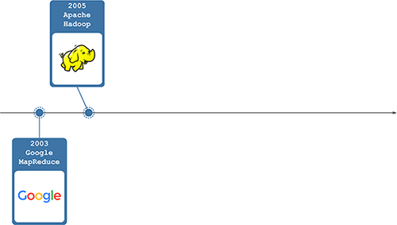
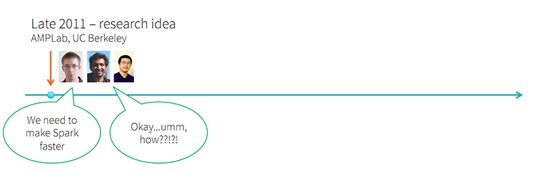
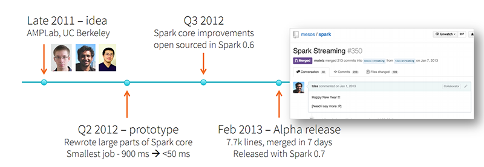

## Spark Streaming 源码解析系列

[「腾讯广告」](http://e.qq.com)技术团队（原腾讯广点通技术团队）荣誉出品

```
本系列内容适用范围：

* 2018.11.02 update, Spark 2.4 全系列 √ (已发布：2.4.0)
* 2018.02.28 update, Spark 2.3 全系列 √ (已发布：2.3.0 ~ 2.3.2)
* 2017.07.11 update, Spark 2.2 全系列 √ (已发布：2.2.0 ~ 2.2.3)
```

- *概述*
  - [0.1 Spark Streaming 实现思路与模块概述](0.1%20Spark%20Streaming%20实现思路与模块概述.md)
- *模块 1：DAG 静态定义*
  - [1.1 DStream, DStreamGraph 详解](1.1%20DStream%2C%20DStreamGraph%20详解.md)
  - [1.2 DStream 生成 RDD 实例详解](1.2%20DStream%20生成%20RDD%20实例详解.md)
- *模块 2：Job 动态生成*
  - [2.1 JobScheduler, Job, JobSet 详解](2.1%20JobScheduler%2C%20Job%2C%20JobSet%20详解.md)
  - [2.2 JobGenerator 详解](2.2%20JobGenerator%20详解.md)
- *模块 3：数据产生与导入*
  - [3.1 Receiver 分发详解](3.1%20Receiver%20分发详解.md) 
  - [3.2 Receiver, ReceiverSupervisor, BlockGenerator, ReceivedBlockHandler 详解](3.2%20Receiver%2C%20ReceiverSupervisor%2C%20BlockGenerator%2C%20ReceivedBlockHandler%20详解.md)
  - [3.3 ReceiverTraker, ReceivedBlockTracker 详解](3.3%20ReceiverTraker%2C%20ReceivedBlockTracker%20详解.md)
- *模块 4：长时容错*
  - [4.1 Executor 端长时容错详解](4.1%20Executor%20端长时容错详解.md)
  - [4.2 Driver 端长时容错详解](4.2%20Driver%20端长时容错详解.md)
- *StreamingContext*
  - 5.1 StreamingContext 详解
- *一些资源和 Q&A*
  - [Spark 资源集合](https://github.com/lw-lin/CoolplaySpark/tree/master/Spark%20%E8%B5%84%E6%BA%90%E9%9B%86%E5%90%88) (包括 Spark Summit 视频，Spark 中文微信群等资源集合)<br/>
  - [(Q&A) 什么是 end-to-end exactly-once?](Q%26A%20什么是%20end-to-end%20exactly-once.md)

## 致谢

- Github @wongxingjun 同学指出 3 处 typo，并提 Pull Request 修正（PR 已合并）
- Github @endymecy 同学指出 2 处 typo，并提 Pull Request 修正（PR 已合并）
- Github @Lemonjing 同学指出几处 typo，并提 Pull Request 修正（PR 已合并）
- Github @xiaoguoqiang 同学指出 1 处 typo，并提 Pull Request 修正（PR 已合并）
- Github 张瀚 (@AntikaSmith) 同学指出 1 处 问题（已修正）
- Github Tao Meng (@mtunique) 同学指出 1 处 typo，并提 Pull Request 修正（PR 已合并）
- Github @ouyangshourui 同学指出 1 处问题，并提 Pull Request 修正（PR 已合并）
- Github @jacksu 同学指出 1 处问题，并提 Pull Request 修正（PR 已合并）
- Github @klion26 同学指出 1 处 typo（已修正）
- Github @397090770 同学指出 1 处配图笔误（已修正）
- Github @ubtaojiang1982 同学指出 1 处 typo（已修正）
- Github @marlin5555 同学指出 1 处配图遗漏信息（已修正）
- Weibo @wyggggo 同学指出 1 处 typo（已修正）

## Spark Streaming 史前史(1)

作为跑在商业硬件上的大数据处理框架，Apache Hadoop 在诞生后的几年内（2005~今）火的一塌糊涂，几乎成为了业界处理大数据的事实上的标准工具：



## Spark Streaming 史前史(2)

不过大家逐渐发现还需要有单独针对流式数据（其特点是源数据实时性高，要求处理延迟低）的处理需求；于是自 2010 年起又流行起了很多通用流数据处理框架，这种与 Hadoop 等批处理框架配合使用的“批+实时”的双引擎架构又成为了当前事实上的标准：


  ps: 前段时间跟一位前 Googler（很巧他是 MillWheel 的第一批用户）一起吃饭时，了解到 MillWheel 原来是 2010 年左右开发的，据说极其极其好用。

## Spark Streaming 诞生





本系列文章，就来详解发布于 2013 年的 Spark Streaming。

## 知识共享


除非另有注明，本《Spark Streaming 源码解析系列》系列文章使用 [CC BY-NC（署名-非商业性使用）](https://creativecommons.org/licenses/by-nc/4.0/) 知识共享许可协议。
