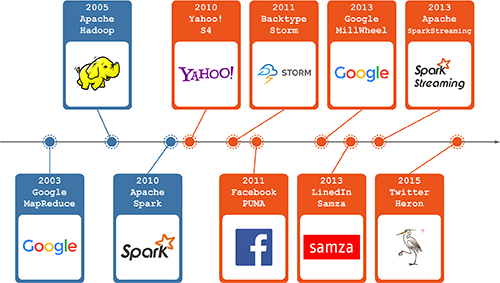

## [酷玩 Spark] Spark Streaming 源码解析系列

- *概述*
	- [0.1 Spark Streaming 实现思路与模块概述](0.1 Spark Streaming 实现思路与模块概述.md)
- *模块 1：DAG 静态定义*
	- `预计 12.05` 1.1 DStream, DStreamGraph 详解 
	- `预计 12.08` 1.2 DStream 生成 RDD 实例详解 
- *模块 2：Job 动态生成*
	- `预计 12.12` 2.1 JobScheduler, Job, JobSet 详解
	- `预计 12.15` 2.2 JobGenerator 详解
- *模块 3：数据产生与导入*
	- `预计 12.19` 3.1 Receiver 分发详解 
	- `预计 12.22` 3.2 Receiver, ReceiverSupervisor, BlockGenerator, ReceivedBlockHandler 详解
	- `预计 12.26` 3.3 ReceiverTraker, ReceivedBlockTracker 详解
- *模块 4：长时容错*
	- `预计 12.29` 4.1 Executor 端长时容错详解
	- `预计 01.02` 4.2 Driver 端长时容错详解
- *StreamingContext*
	- `预计 01.05` 5.1 StreamingContext 详解

## Spark Streaming 史前史(1)

作为跑在商业硬件上的大数据处理框架，Apache Hadoop 在诞生后的几年内（2005~今）火的一塌糊涂，几乎成为了业界处理大数据的事实上的标准工具：

## Spark Streaming 史前史(2)

不过大家逐渐发现还需要有单独针对流式数据（其特点是源数据实时性高，要求处理延迟低）的处理需求；于是自 2010 年起又流行起了很多通用流数据处理框架，这种与 Hadoop 等批处理框架配合使用的“批+实时”的双引擎架构又成为了当前事实上的标准：

## Spark Streaming 诞生

本系列文章，就来详解发布于 2013 年的 Spark Streaming。