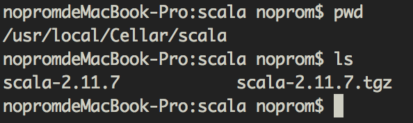
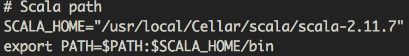
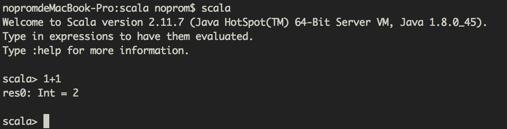
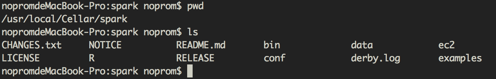
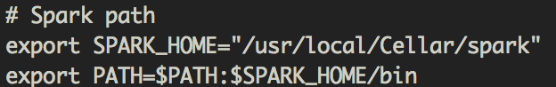
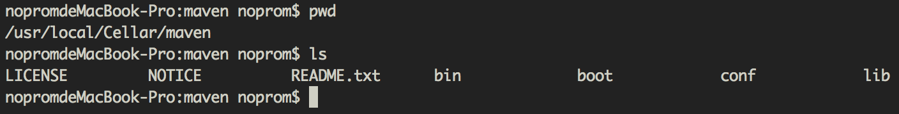
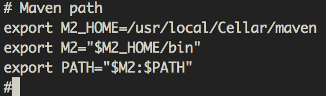
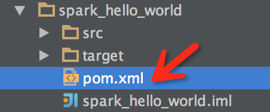
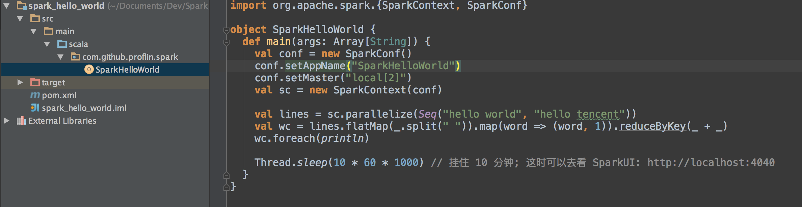
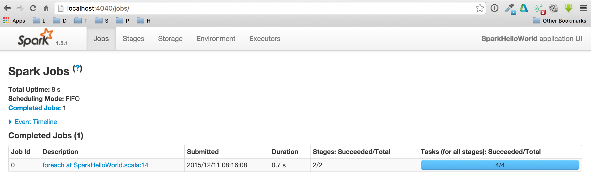

# 如何将这个 Hello world 在mac上用idea跑起来 #

## 一、安装JDK

首先没有安装JKD的小伙伴可以按照以下步骤安装jkd。

1. 首先可以到[官网](http://www.oracle.com/technetwork/java/javase/downloads/jdk8-downloads-2133151.html)下载自己对应的版本，我这里下载的是jdk-8u65-macosx-x64.dmg这个mac版本的。
2. 对于mac用户来说安装上面的文件就行了。

## 二、安装Scala

1. 首先可以到[官网](http://www.scala-lang.org/download/)下载自己对应的版本，我这里下载的是 2.11.7这个版本的。
2. 将下载好的scala解压，我这里是解压到

这个目录下面的。
3. 设置环境变量:vim ~/.bash_profile，在里面添加scala的路径：

4. 让它生效：source ~/.bash_profile 
5. 验证一下：

## 三、安装Spark

1. 首先可以到[官网](http://www.scala-lang.org/download/)下载自己对应的版本，我这里下载的是 spark-1.5.0-bin-hadoop2.4 这个预编译版本的。
2. 将下载好的scala解压，我这里是解压到

这个目录下面的。
3. 设置环境变量:vim ~/.bash_profile，在里面添加spark的路径：

4. 让它生效：source ~/.bash_profile

## 四、安装Maven

1. 首先可以到[官网](http://maven.apache.org/download.cgi)下载自己对应的版本。
2. 将下载好的maven解压，我这里是解压到

这个目录下面的。
3. 设置环境变量:vim ~/.bash_profile，在里面添加maven的路径：

4. 让它生效：source ~/.bash_profile

## 五、克隆本项目

1. git clone https://github.com/proflin/CoolplaySpark.git
2. 在idea里面导入这个项目：File->New->Project from Esisting Sources..

3. 之后等待idea漫长的导包过程...
4. 完毕之后可以看到项目的结构是这样的

5. 右键：
6. 看一下UI界面：
7. 看到这个界面，之后你就可以愉快的玩耍Spark了😄 

