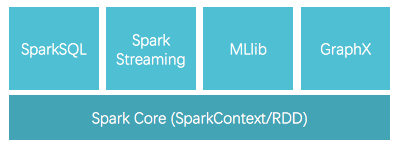
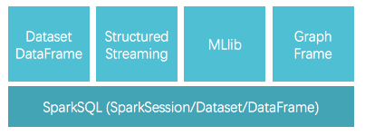
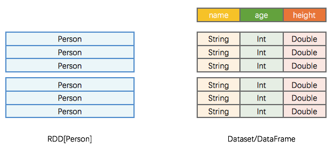
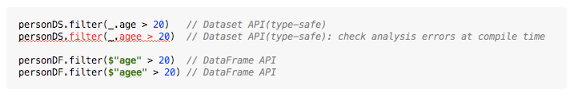
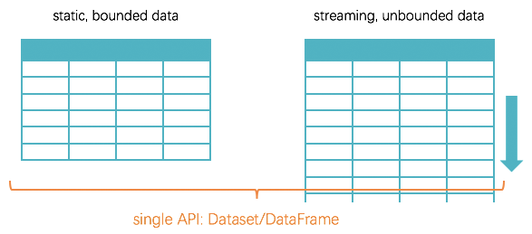
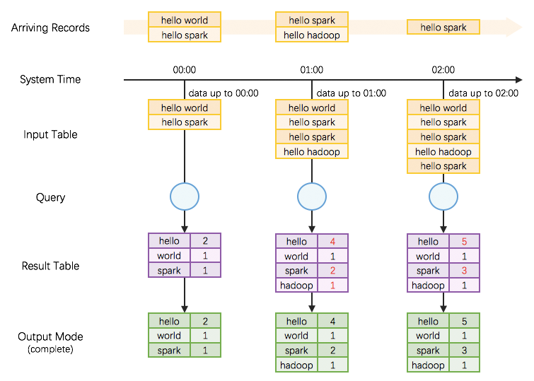
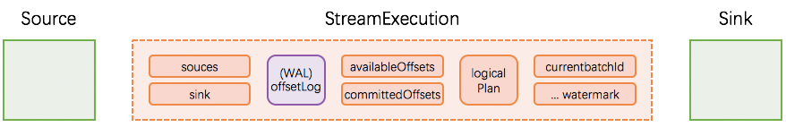
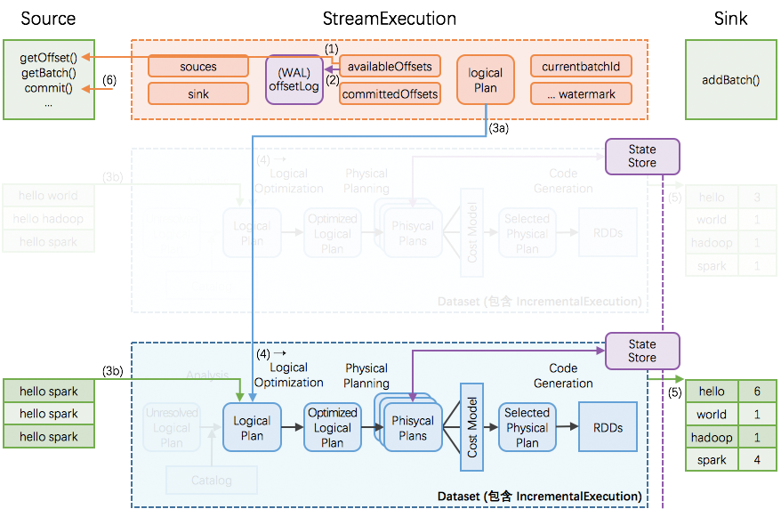
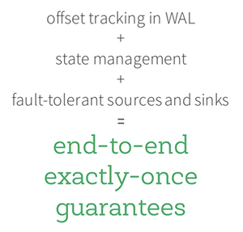

# Structured Streaming 实现思路与实现概述 #

***[酷玩 Spark] Structured Streaming 源码解析系列*** ，返回目录请 [猛戳这里](.)

[「腾讯广告」](http://e.qq.com)技术团队（原腾讯广点通技术团队）荣誉出品

```
本文内容适用范围：
* 2018.11.02 update, Spark 2.4 全系列 √ (已发布：2.4.0)
* 2018.02.28 update, Spark 2.3 全系列 √ (已发布：2.3.0 ~ 2.3.2)
* 2017.07.11 update, Spark 2.2 全系列 √ (已发布：2.2.0 ~ 2.2.3)
```

本文目录

<p>
<a href="#一引言spark-2-时代">一、引言：Spark 2 时代!</a><br/>
<a href="#二从-structured-data-到-structured-streaming">二、从 Structured Data 到 Structured Streaming</a><br/>
<a href="#三structured-streaming无限增长的表格">三、Structured Streaming：无限增长的表格</a><br/>
<a href="#四streamexecution持续查询的运转引擎">四、StreamExecution：持续查询的运转引擎</a><br/>
　　<a href="#1-streamexecution-的初始状态">1. StreamExecution 的初始状态</a><br/>
　　<a href="#2-streamexecution-的持续查询">2. StreamExecution 的持续查询</a><br/>
　　<a href="#3-streamexecution-的持续查询增量">3. StreamExecution 的持续查询（增量）</a><br/>
　　<a href="#4-故障恢复">4. 故障恢复</a><br/>
　　<a href="#5-sources-与-sinks">5. Sources 与 Sinks</a><br/>
　　<a href="#6-小结end-to-end-exactly-once-guarantees">6. 小结：end-to-end exactly-once guarantees</a><br/>
<a href="#五全文总结">五、全文总结</a><br/>
<a href="#六扩展阅读">六、扩展阅读</a><br/>
<a href="#参考资料">参考资料</a>
</p>

## 一、引言：Spark 2 时代!

<p align="center"></p>

Spark 1.x 时代里，以 SparkContext（及 RDD API）为基础，在 structured data 场景衍生出了 SQLContext, HiveContext，在 streaming 场景衍生出了 StreamingContext，很是琳琅满目。

<p align="center"></p>

Spark 2.x 则咔咔咔精简到只保留一个 SparkSession 作为主程序入口，以 Dataset/DataFrame 为主要的用户 API，同时满足 structured data, streaming data, machine learning, graph 等应用场景，大大减少使用者需要学习的内容，爽爽地又重新实现了一把当年的 "one stack to rule them all" 的理想。

<p align="center"></p>

我们这里简单回顾下 Spark 2.x 的 Dataset/DataFrame 与 Spark 1.x 的 RDD 的不同：

- Spark 1.x 的 RDD 更多意义上是一个一维、只有行概念的数据集，比如 `RDD[Person]`，那么一行就是一个 `Person`，存在内存里也是把 `Person` 作为一个整体（序列化前的 java object，或序列化后的 bytes）。
- Spark 2.x 里，一个 `Person` 的 Dataset 或 DataFrame，是二维行+列的数据集，比如一行一个 `Person`，有 `name:String`, `age:Int`, `height:Double` 三列；在内存里的物理结构，也会显式区分列边界。
  - Dataset/DataFrame 在 API 使用上有区别：Dataset 相比 DataFrame 而言是 type-safe 的，能够在编译时对 AnalysisExecption 报错（如下图示例）: 
  - Dataset/DataFrame 存储方式无区别：两者在内存中的存储方式是完全一样的、是按照二维行列（UnsafeRow）来存的，所以在没必要区分 `Dataset` 或 `DataFrame` 在 API 层面的差别时，我们统一写作 `Dataset/DataFrame`

> [小节注] 其实 Spark 1.x 就有了 Dataset/DataFrame 的概念，但还仅是 SparkSQL 模块的主要 API ；到了 2.0 时则 Dataset/DataFrame 不局限在 SparkSQL、而成为 Spark 全局的主要 API。

## 二、从 Structured Data 到 Structured Streaming

使用 Dataset/DataFrame 的行列数据表格来表达 structured data，既容易理解，又具有广泛的适用性：

- Java 类 `class Person { String name; int age; double height}` 的多个对象可以方便地转化为  `Dataset/DataFrame`
- 多条 json 对象比如 `{name: "Alice", age: 20, height: 1.68}, {name: "Bob", age: 25, height: 1.76}` 可以方便地转化为  `Dataset/DataFrame`
- 或者 MySQL 表、行式存储文件、列式存储文件等等等都可以方便地转化为  `Dataset/DataFrame`

Spark 2.0 更进一步，使用 Dataset/Dataframe 的行列数据表格来扩展表达 streaming data —— 所以便横空出世了 Structured Streaming 、《Structured Streaming 源码解析系列》—— 与静态的 structured data 不同，动态的 streaming data 的行列数据表格是一直无限增长的（因为 streaming data 在源源不断地产生）！

<p align="center"></p>

## 三、Structured Streaming：无限增长的表格

基于“无限增长的表格”的编程模型 [1]，我们来写一个 streaming 的 word count：

<p align="center"></p>

对应的 Structured Streaming 代码片段：

```scala
val spark = SparkSession.builder().master("...").getOrCreate()  // 创建一个 SparkSession 程序入口

val lines = spark.readStream.textFile("some_dir")  // 将 some_dir 里的内容创建为 Dataset/DataFrame；即 input table
val words = lines.flatMap(_.split(" "))
val wordCounts = words.groupBy("value").count()    // 对 "value" 列做 count，得到多行二列的 Dataset/DataFrame；即 result table

val query = wordCounts.writeStream                 // 打算写出 wordCounts 这个 Dataset/DataFrame
  .outputMode("complete")                          // 打算写出 wordCounts 的全量数据
  .format("console")                               // 打算写出到控制台
  .start()                                         // 新起一个线程开始真正不停写出

query.awaitTermination()                           // 当前用户主线程挂住，等待新起来的写出线程结束
```

这里需要说明几点：

- Structured Streaming 也是先纯定义、再触发执行的模式，即
  - 前面大部分代码是 ***纯定义*** Dataset/DataFrame 的产生、变换和写出
  - 后面位置再真正 ***start*** 一个新线程，去触发执行之前的定义
- 在新的执行线程里我们需要 ***持续地*** 去发现新数据，进而 ***持续地*** 查询最新计算结果至写出
  - 这个过程叫做 ***continous query（持续查询）***

## 四、StreamExecution：持续查询的运转引擎

现在我们将目光聚焦到 ***continuous query*** 的驱动引擎（即整个 Structured Streaming 的驱动引擎） StreamExecution 上来。

### 1. StreamExecution 的初始状态

我们前文刚解析过，先定义好 Dataset/DataFrame 的产生、变换和写出，再启动 StreamExection 去持续查询。这些 Dataset/DataFrame 的产生、变换和写出的信息就对应保存在 StreamExecution 非常重要的 3 个成员变量中：

- `sources`: streaming data 的产生端（比如 kafka 等）
- `logicalPlan`: DataFrame/Dataset 的一系列变换（即计算逻辑）
- `sink`: 最终结果写出的接收端（比如 file system 等）

StreamExection 另外的重要成员变量是：

- `currentBatchId`: 当前执行的 id
- `batchCommitLog`: 已经成功处理过的批次有哪些
- `offsetLog`, `availableOffsets`, `committedOffsets`: 当前执行需要处理的 source data 的 meta 信息
- `offsetSeqMetadata`: 当前执行的 watermark 信息（event time 相关，本文暂不涉及、另文解析）等

我们将 Source, Sink, StreamExecution 及其重要成员变量标识在下图，接下来将逐个详细解析。



### 2. StreamExecution 的持续查询


一次执行的过程如上图；这里有 6 个关键步骤：

1. StreamExecution 通过 Source.getOffset() 获取最新的 offsets，即最新的数据进度；
2. StreamExecution 将 offsets 等写入到 offsetLog 里
     - 这里的 offsetLog 是一个持久化的 WAL (Write-Ahead-Log)，是将来可用作故障恢复用
3. StreamExecution 构造本次执行的 LogicalPlan
     - (3a) 将预先定义好的逻辑（即 StreamExecution 里的 logicalPlan 成员变量）制作一个副本出来
     - (3b) 给定刚刚取到的 offsets，通过 Source.getBatch(offsets) 获取本执行新收到的数据的 Dataset/DataFrame 表示，并替换到 (3a) 中的副本里
     - 经过 (3a), (3b) 两步，构造完成的 LogicalPlan 就是针对本执行新收到的数据的 Dataset/DataFrame 变换（即整个处理逻辑）了
4. 触发对本次执行的 LogicalPlan 的优化，得到 IncrementalExecution
     - 逻辑计划的优化：通过 Catalyst 优化器完成
     - 物理计划的生成与选择：结果是可以直接用于执行的 RDD DAG
     - 逻辑计划、优化的逻辑计划、物理计划、及最后结果 RDD DAG，合并起来就是 IncrementalExecution
5. 将表示计算结果的 Dataset/DataFrame (包含 IncrementalExecution) 交给 Sink，即调用 Sink.add(ds/df)
6. 计算完成后的 commit
     - (6a) 通过 Source.commit() 告知 Source 数据已经完整处理结束；Source 可按需完成数据的 garbage-collection
     - (6b) 将本次执行的批次 id 写入到 batchCommitLog 里

### 3. StreamExecution 的持续查询（增量）



Structured Streaming 在编程模型上暴露给用户的是，每次持续查询看做面对全量数据（而不仅仅是本次执行信收到的数据），所以每次执行的结果是针对全量数据进行计算的结果。

但是在实际执行过程中，由于全量数据会越攒越多，那么每次对全量数据进行计算的代价和消耗会越来越大。

Structured Streaming 的做法是：

- 引入全局范围、高可用的 StateStore
- 转全量为增量，即在每次执行时：
    - 先从 StateStore 里 restore 出上次执行后的状态
    - 然后加入本执行的新数据，再进行计算
    - 如果有状态改变，将把改变的状态重新 save 到 StateStore 里
- 为了在 Dataset/DataFrame 框架里完成对 StateStore 的 restore 和 save 操作，引入两个新的物理计划节点 —— StateStoreRestoreExec 和 StateStoreSaveExec

所以 Structured Streaming 在编程模型上暴露给用户的是，每次持续查询看做面对全量数据，但在具体实现上转换为增量的持续查询。

### 4. 故障恢复

通过前面小节的解析，我们知道存储 source offsets 的 offsetLog，和存储计算状态的 StateStore，是全局高可用的。仍然采用前面的示意图，offsetLog 和 StateStore 被特殊标识为紫色，代表高可用。


由于 exectutor 节点的故障可由 Spark 框架本身很好的 handle，不引起可用性问题，我们本节的故障恢复只讨论 driver 故障恢复。

如果在某个执行过程中发生 driver 故障，那么重新起来的 StreamExecution：

- 读取 WAL offsetlog 恢复出最新的 offsets 等；相当于取代正常流程里的 (1)(2) 步
- 读取 batchCommitLog 决定是否需要重做最近一个批次
- 如果需要，那么重做 (3a), (3b), (4), (5), (6a), (6b) 步
  - 这里第 (5) 步需要分两种情况讨论
    - (i) 如果上次执行在 (5) ***结束前即失效***，那么本次执行里 sink 应该完整写出计算结果
    - (ii) 如果上次执行在 (5) ***结束后才失效***，那么本次执行里 sink 可以重新写出计算结果（覆盖上次结果），也可以跳过写出计算结果（因为上次执行已经完整写出过计算结果了）

这样即可保证每次执行的计算结果，在 sink 这个层面，是 ***不重不丢*** 的 —— 即使中间发生过 1 次或以上的失效和恢复。

### 5. Sources 与 Sinks

可以看到，Structured Streaming 层面的 Source，需能 ***根据 offsets 重放数据***  [2]。所以：

|             Sources             |              是否可重放               | 原生内置支持  |                    注解                    |
| :-----------------------------: | :------------------------------: | :-----: | :--------------------------------------: |
| **HDFS-compatible file system** |    |   已支持   | 包括但不限于 text, json, csv, parquet, orc, ... |
|            **Kafka**            |    |   已支持   |              Kafka 0.10.0+               |
|         **RateStream**          |    |   已支持   |                以一定速率产生数据                 |
|            **RDBMS**            |    | *(待支持)* |                预计后续很快会支持                 |
|           **Socket**            |  |   已支持   |           主要用途是在技术会议/讲座上做 demo           |
|       **Receiver-based**        |  |  不会支持   |              就让这些前浪被拍在沙滩上吧               |

也可以看到，Structured Streaming 层面的 Sink，需能 ***幂等式写入数据***  [3]。所以：

|              Sinks              |              是否幂等写入              | 原生内置支持  |                    注解                    |
| :-----------------------------: | :------------------------------: | :-----: | :--------------------------------------: |
| **HDFS-compatible file system** |    |   已支持   | 包括但不限于 text, json, csv, parquet, orc, ... |
|    **ForeachSink** (自定操作幂等)     |    |   已支持   |              可定制度非常高的 sink               |
|            **RDBMS**            |    | *(待支持)* |                预计后续很快会支持                 |
|            **Kafka**            |  |   已支持   | Kafka 目前不支持幂等写入，所以可能会有重复写入<br/>（但推荐接着 Kafka 使用 streaming de-duplication 来去重） |
|    **ForeachSink** (自定操作不幂等)    |  |   已支持   |              不推荐使用不幂等的自定操作               |
|           **Console**           |  |   已支持   |           主要用途是在技术会议/讲座上做 demo           |

### 6. 小结：end-to-end exactly-once guarantees

所以在 Structured Streaming 里，我们总结下面的关系[4]：

<p align="center"></p>

这里的 end-to-end 指的是，如果 source 选用类似 Kafka, HDFS 等，sink 选用类似 HDFS, MySQL 等，那么 Structured Streaming 将自动保证在 sink 里的计算结果是 exactly-once 的 —— Structured Streaming 终于把过去需要使用者去维护的 sink 去重逻辑接盘过去了！:-)

## 五、全文总结

自 Spark 2.0 开始，处理 structured data 的 Dateset/DataFrame 被扩展为同时处理 streaming data，诞生了 Structured Streaming。

Structured Streaming 以“无限扩展的表格”为编程模型，在 StreamExecution 实际执行中增量执行，并满足 end-to-end exactly-once guarantee.

在 Spark 2.0 时代，Dataset/DataFrame 成为主要的用户 API，同时满足 structured data, streaming data, machine learning, graph 等应用场景，大大减少使用者需要学习的内容，爽爽地又重新实现了一把当年的 "one stack to rule them all" 的理想。

> 谨以此《Structured Streaming 源码解析系列》和以往的《Spark Streaming 源码解析系列》，向“把大数据变得更简单 (make big data simple) ”的创新者们，表达感谢和敬意。

## 六、扩展阅读

1. Spark Summit East 2016: [The Future of Real-time in Spark](https://spark-summit.org/east-2016/events/keynote-day-3/)
2. Blog: [Continuous Applications: Evolving Streaming in Apache Spark 2.0](https://databricks.com/blog/2016/07/28/continuous-applications-evolving-streaming-in-apache-spark-2-0.html)
3. Blog: [Structured Streaming In Apache Spark: A new high-level API for streaming](https://databricks.com/blog/2016/07/28/structured-streaming-in-apache-spark.html)

## 参考资料

1. [Structured Streaming Programming Guide](http://spark.apache.org/docs/latest/structured-streaming-programming-guide.html)
2. [Github: org/apache/spark/sql/execution/streaming/Source.scala](https://github.com/apache/spark/blob/master/sql/core/src/main/scala/org/apache/spark/sql/execution/streaming/Source.scala)
3. [Github: org/apache/spark/sql/execution/streaming/Sink.scala](https://github.com/apache/spark/blob/master/sql/core/src/main/scala/org/apache/spark/sql/execution/streaming/Sink.scala)
4. [A Deep Dive into Structured Streaming](http://www.slideshare.net/databricks/a-deep-dive-into-structured-streaming?qid=51953136-8233-4d5d-a1c2-ce30051f16d1&v=&b=&from_search=1)

## 知识共享


除非另有注明，本《Structured Streaming 源码解析系列》系列文章使用 [CC BY-NC（署名-非商业性使用）](https://creativecommons.org/licenses/by-nc/4.0/) 知识共享许可协议。<br/>
<br/>
（本文完，参与本文的讨论请 [猛戳这里](https://github.com/lw-lin/CoolplaySpark/issues/29)，返回目录请 [猛戳这里](.)）
