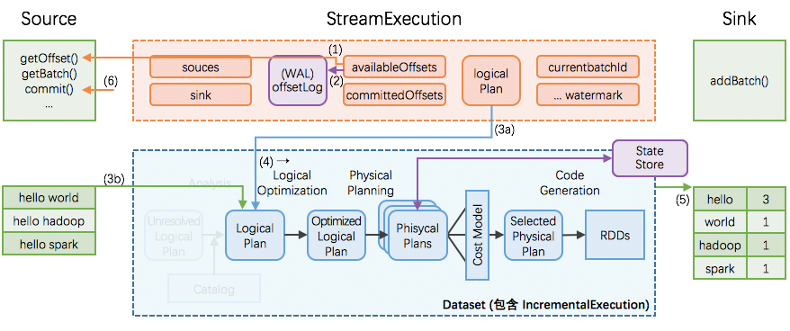

# Structured Streaming 之 Sink 解析 #

***[酷玩 Spark] Structured Streaming 源码解析系列*** ，返回目录请 [猛戳这里](.)

[「腾讯广告」](http://e.qq.com)技术团队（原腾讯广点通技术团队）荣誉出品

```
本文内容适用范围：
* 2018.11.02 update, Spark 2.4 全系列 √ (已发布：2.4.0)
* 2018.02.28 update, Spark 2.3 全系列 √ (已发布：2.3.0 ~ 2.3.2)
* 2017.07.11 update, Spark 2.2 全系列 √ (已发布：2.2.0 ~ 2.2.3)
```


阅读本文前，请一定先阅读 [Structured Streaming 实现思路与实现概述](1.1%20Structured%20Streaming%20实现思路与实现概述.md) 一文，其中概述了 Structured Streaming 的实现思路（包括 StreamExecution, Source, Sink 等在 Structured Streaming 里的作用），有了全局概念后再看本文的细节解释。

## 引言

Structured Streaming 非常显式地提出了输入(Source)、执行(StreamExecution)、输出(Sink)的 3 个组件，并且在每个组件显式地做到 fault-tolerant，由此得到整个 streaming 程序的 end-to-end exactly-once guarantees.

具体到源码上，Sink 是一个抽象的接口 [trait Sink](https://github.com/apache/spark/blob/master/sql/core/src/main/scala/org/apache/spark/sql/execution/streaming/Sink.scala) [1]，只有一个方法：

```scala
trait Sink {
  def addBatch(batchId: Long, data: DataFrame): Unit
}
```

这个仅有的 `addBatch()` 方法支持了 Structured Streaming 实现 end-to-end exactly-once 处理所一定需要的功能。我们将马上解析这个 `addBatch()` 方法。

相比而言，前作 Spark Streaming 并没有对输出进行特别的抽象，而只是在 DStreamGraph [2] 里将一些 dstreams 标记为了 output。当需要 exactly-once 特性时，程序员可以根据当前批次的时间标识，来 ***自行维护和判断*** 一个批次是否已经执行过。

进化到 Structured Streaming 后，显式地抽象出了 Sink，并提供了一些原生幂等的 Sink 实现：

- 已支持
  - HDFS-compatible file system，具体实现是 FileStreamSink extends Sink
  - Foreach sink，具体实现是 ForeachSink extends Sink
  - Kafka sink，具体实现是 KafkaSink extends Sink
- 预计后续很快会支持
  - RDBMS

## Sink：方法与功能

在 Structured Streaming 里，由 StreamExecution 作为持续查询的驱动器，分批次不断地：



1. 在每个 StreamExecution 的批次最开始，StreamExecution 会向 Source 询问当前 Source 的最新进度，即最新的 offset
2. 这个 Offset 给到 StreamExecution 后会被 StreamExecution 持久化到自己的 WAL 里
3. 由 Source 根据 StreamExecution 所要求的 start offset、end offset，提供在 `(start, end]` 区间范围内的数据
4. StreamExecution 触发计算逻辑 logicalPlan 的优化与编译
5. 把计算结果写出给 Sink
     - 具体是由 StreamExecution 调用 `Sink.addBatch(batchId: Long, data: DataFrame)`
     - 注意这时才会由 Sink 触发发生实际的取数据操作，以及计算过程
     - 通常 Sink 直接可以直接把 `data: DataFrame` 的数据写出，并在完成后记录下 `batchId: Long`
     - 在故障恢复时，分两种情况讨论：
       - (i) 如果上次执行在本步 ***结束前即失效***，那么本次执行里 sink 应该完整写出计算结果
       - (ii) 如果上次执行在本步 ***结束后才失效***，那么本次执行里 sink 可以重新写出计算结果（覆盖上次结果），也可以跳过写出计算结果（因为上次执行已经完整写出过计算结果了）
6. 在数据完整写出到 Sink 后，StreamExecution 通知 Source 可以废弃数据；然后把成功的批次 id 写入到 batchCommitLog

## Sink 的具体实现：HDFS-API compatible FS, Foreach

### (a) 具体实现: HDFS-API compatible FS

通常我们使用如下方法方法写出到  HDFS-API compatible FS:

```scala
writeStream
  .format("parquet")      // parquet, csv, json, text, orc ...
  .option("checkpointLocation", "path/to/checkpoint/dir")
  .option("path", "path/to/destination/dir")
```

那么我们看这里 `FileStreamSink` 具体的  `addBatch()` 实现是：

```scala
  // 来自：class FileStreamSink extends Sink
  // 版本：Spark 2.1.0
  override def addBatch(batchId: Long, data: DataFrame): Unit = {
    /* 首先根据持久化的 fileLog 来判断这个 batchId 是否已经写出过 */
    if (batchId <= fileLog.getLatest().map(_._1).getOrElse(-1L)) {
      /* 如果 batchId 已经完整写出过，则本次跳过 addBatch */
      logInfo(s"Skipping already committed batch $batchId")
    } else {
      /* 本次需要具体执行写出 data */
      /* 初始化 FileCommitter -- FileCommitter 能正确处理 task 推测执行、task 失败重做等情况 */
      val committer = FileCommitProtocol.instantiate(
        className = sparkSession.sessionState.conf.streamingFileCommitProtocolClass,
        jobId = batchId.toString,
        outputPath = path,
        isAppend = false)

      committer match {
        case manifestCommitter: ManifestFileCommitProtocol =>
          manifestCommitter.setupManifestOptions(fileLog, batchId)
        case _ =>  // Do nothing
      }

      /* 获取需要做 partition 的 columns */
      val partitionColumns: Seq[Attribute] = partitionColumnNames.map { col =>
        val nameEquality = data.sparkSession.sessionState.conf.resolver
        data.logicalPlan.output.find(f => nameEquality(f.name, col)).getOrElse {
          throw new RuntimeException(s"Partition column $col not found in schema ${data.schema}")
        }
      }

      /* 真正写出数据 */
      FileFormatWriter.write(
        sparkSession = sparkSession,
        queryExecution = data.queryExecution,
        fileFormat = fileFormat,
        committer = committer,
        outputSpec = FileFormatWriter.OutputSpec(path, Map.empty),
        hadoopConf = hadoopConf,
        partitionColumns = partitionColumns,
        bucketSpec = None,
        refreshFunction = _ => (),
        options = options)
    }
  }
```

### (b) 具体实现: Foreach

通常我们使用如下方法写出到 foreach sink:

```scala
writeStream
  /* 假设进来的每条数据是 String 类型的 */
  .foreach(new ForeachWriter[String] {
    /* 每个 partition 即每个 task 会在开始时调用此 open() 方法 */
    /* 注意对于同一个 partitionId/version，此方法可能被先后调用多次，如 task 失效重做时 */
    /* 注意对于同一个 partitionId/version，此方法也可能被同时调用，如推测执行时 */
    override def open(partitionId: Long, version: Long): Boolean = {
      println(s"open($partitionId, $version)")
      true
    }
    /* 此 partition 内即每个 task 内的每条数据，此方法都被调用 */
    override def process(value: String): Unit = println(s"process $value")
    /* 正常结束或异常结束时，此方法被调用。但一些异常情况时，此方法不一定被调用。 */
    override def close(errorOrNull: Throwable): Unit = println(s"close($errorOrNull)")
  })
```

那么我们看这里 `ForeachSink` 具体的  `addBatch()` 实现是：

```scala
  // 来自：class ForeachSink extends Sink with Serializable
  // 版本：Spark 2.1.0
  override def addBatch(batchId: Long, data: DataFrame): Unit = {
    val encoder = encoderFor[T].resolveAndBind(
      data.logicalPlan.output,
      data.sparkSession.sessionState.analyzer)
    /* 是 rdd 的 foreachPartition，即是 task 级别 */
    data.queryExecution.toRdd.foreachPartition { iter =>
      /* partition/task 级别的 open */
      if (writer.open(TaskContext.getPartitionId(), batchId)) {
        try {
          while (iter.hasNext) {
            /* 对每条数据调用 process() 方法 */
            writer.process(encoder.fromRow(iter.next()))
          }
        } catch {
          case e: Throwable =>
            /* 异常时调用 close() 方法 */
            writer.close(e)
            throw e
        }
        /* 正常写完调用 close() 方法 */
        writer.close(null)
      } else {
        /* 不写数据、直接调用 close() 方法 */
        writer.close(null)
      }
    }
  }
```

所以我们看到，foreach sink 需要使用者提供 writer，所以这里的可定制度就非常高。

但是仍然需要注意，由于 foreach 的 writer 可能被 open() 多次，可能有多个 task 同时调用一个 writer。所以推荐 writer 一定要写成幂等的，如果 writer 不幂等、那么 Structured Streaming 框架本身也没有更多的办法能够保证 end-to-end exactly-once guarantees 了。

### (c) 具体实现: Kafka

Spark 2.1.1 版本开始加入了 KafkaSink，使得 Spark 也能够将数据写入到 kafka 中。

通常我们使用如下方法写出到 kafka sink:

```scala
writeStream
  .format("kafka")
  .option("checkpointLocation", ...)
  .outputMode(...)
  .option("kafka.bootstrap.servers", ...) // 写出到哪个集群
  .option("topic", ...) // 写出到哪个 topic
```

那么我们看这里 `KafkaSink` 具体的  `addBatch()` 实现是：

```scala
  // 来自：class KafkaSink extends Sink
  // 版本：Spark 2.1.1, 2.2.0
  override def addBatch(batchId: Long, data: DataFrame): Unit = {
    if (batchId <= latestBatchId) {
      logInfo(s"Skipping already committed batch $batchId")
    } else {
      // 主要是通过 KafkaWriter.write() 来做写出；
      // 在 KafkaWriter.write() 里，主要是继续通过 KafkaWriteTask.execute() 来做写出
      KafkaWriter.write(sqlContext.sparkSession,
        data.queryExecution, executorKafkaParams, topic)
      latestBatchId = batchId
    }
  }
```

那么我们继续看这里 `KafkaWriteTask` 具体的  `execute()` 实现是：

```scala
  // 来自：class KafkaWriteTask
  // 版本：Spark 2.1.1, 2.2.0
  def execute(iterator: Iterator[InternalRow]): Unit = {
    producer = new KafkaProducer[Array[Byte], Array[Byte]](producerConfiguration)
    while (iterator.hasNext && failedWrite == null) {
      val currentRow = iterator.next()
      // 这里的 projection 主要是构建 projectedRow，使得：
      // 其第 0 号元素是 topic
      // 其第 1 号元素是 key 的 binary 表示
      // 其第 2 号元素是 value 的 binary 表示
      val projectedRow = projection(currentRow)
      val topic = projectedRow.getUTF8String(0)
      val key = projectedRow.getBinary(1)
      val value = projectedRow.getBinary(2)
      if (topic == null) {
        throw new NullPointerException(s"null topic present in the data. Use the " +
        s"${KafkaSourceProvider.TOPIC_OPTION_KEY} option for setting a default topic.")
      }
      val record = new ProducerRecord[Array[Byte], Array[Byte]](topic.toString, key, value)
      val callback = new Callback() {
        override def onCompletion(recordMetadata: RecordMetadata, e: Exception): Unit = {
          if (failedWrite == null && e != null) {
            failedWrite = e
          }
        }
      }
      producer.send(record, callback)
    }
  }
```

这里我们需要说明的是，由于 Spark 本身会失败重做 —— 包括单个 task 的失败重做、stage 的失败重做、整个拓扑的失败重做等 —— 那么同一条数据可能被写入到 kafka 一次以上。由于 kafka 目前还不支持 transactional write，所以多写入的数据不能被撤销，会造成一些重复。当然 kafka 自身的高可用写入（比如写入 broker 了的数据的 ack 消息没有成功送达 producer，导致 producer 重新发送数据时），也有可能造成重复。

在 kafka 支持 transactional write 之前，可能需要下游实现下去重机制。比如如果下游仍然是 Structured Streaming，那么可以使用 streaming deduplication 来获得去重后的结果。

## 总结

我们总结一下截至目前，Sink 已有的具体实现：

|              Sinks              |              是否幂等写入              | 原生内置支持 |                    注解                    |
| :-----------------------------: | :------------------------------: | :----: | :--------------------------------------: |
| **HDFS-compatible file system** |    |  已支持   | 包括但不限于 text, json, csv, parquet, orc, ... |
|    **ForeachSink** (自定操作幂等)     |    |  已支持   |              可定制度非常高的 sink               |
|            **Kafka**            |  |  已支持   | Kafka 目前不支持幂等写入，所以可能会有重复写入<br/>（但推荐接着 Kafka 使用 streaming de-duplication 来去重） |
|    **ForeachSink** (自定操作不幂等)    |  |  已支持   |              不推荐使用不幂等的自定操作               |

这里我们特别强调一下，虽然 Structured Streaming 也内置了 `console` 这个 Source，但其实它的主要用途只是在技术会议/讲座上做 demo，不应用于线上生产系统。

## 参考资料

1. [Github: org/apache/spark/sql/execution/streaming/Sink.scala](https://github.com/apache/spark/blob/master/sql/core/src/main/scala/org/apache/spark/sql/execution/streaming/Sink.scala)
2. [Github: org/apache/spark/streaming/DStreamGraph.scala](https://github.com/apache/spark/blob/master/streaming/src/main/scala/org/apache/spark/streaming/DStreamGraph.scala)

<br/>
<br/>
（本文完，参与本文的讨论请 [猛戳这里](https://github.com/lw-lin/CoolplaySpark/issues/32)，返回目录请 [猛戳这里](.)）
