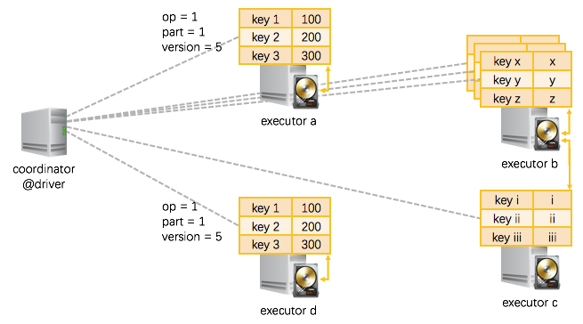
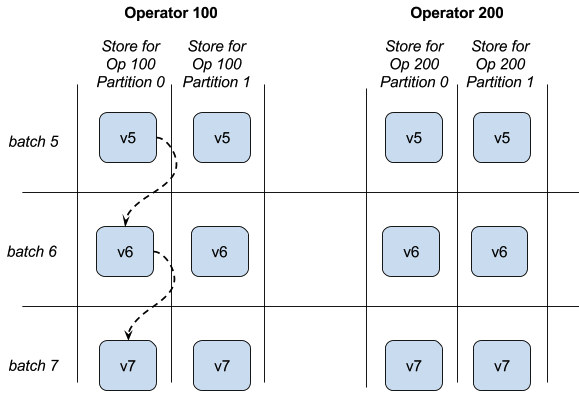

# Structured Streaming 之状态存储解析 #

***[酷玩 Spark] Structured Streaming 源码解析系列*** ，返回目录请 [猛戳这里](.)

[「腾讯广告」](http://e.qq.com)技术团队（原腾讯广点通技术团队）荣誉出品

```
本文内容适用范围：
* 2018.11.02 update, Spark 2.4 全系列 √ (已发布：2.4.0)
* 2018.02.28 update, Spark 2.3 全系列 √ (已发布：2.3.0 ~ 2.3.2)
* 2017.07.11 update, Spark 2.2 全系列 √ (已发布：2.2.0 ~ 2.2.3)
```


阅读本文前，请一定先阅读 [Structured Streaming 实现思路与实现概述](1.1%20Structured%20Streaming%20实现思路与实现概述.md) 一文，其中概述了 Structured Streaming 的实现思路（包括 StreamExecution, StateStore 等在 Structured Streaming 里的作用），有了全局概念后再看本文的细节解释。

## 引言

我们知道，持续查询的驱动引擎 StreamExecution 会持续不断地驱动每个批次的执行。

对于不需要跨批次的持续查询，如 `map()`, `filter()` 等，每个批次之间的执行相互独立，不需要状态支持。而比如类似 `count()` 的聚合式持续查询，则需要跨批次的状态支持，这样本批次的执行只需依赖上一个批次的结果，而不需要依赖之前所有批次的结果。这也即增量式持续查询，能够将每个批次的执行时间稳定下来，避免越后面的批次执行时间越长的情形。

这个增量式持续查询的思路和实现，我们在 [Structured Streaming 实现思路与实现概述](1.1 Structured Streaming 实现思路与实现概述.md) 解析过：

<p align="center"></p>

而在这里面的 StateStore，即是 Structured Streaming 用于保存跨批次状态结果的模块组件。本文解析 StateStore 模块。

## StateStore 模块的总体思路

<p align="center"></p>

StateStore 模块的总体思路：
- 分布式实现
    - 跑在现有 Spark 的 driver-executors 架构上
    - driver 端是轻量级的 coordinator，只做协调工作
    - executor 端负责状态的实际分片的读写
- 状态分片
    - 因为一个应用里可能会包含多个需要状态的 operator，而且 operator 本身也是分 partition 执行的，所以状态存储的分片以 `operatorId`+`partitionId` 为切分依据
    - 以分片为基本单位进行状态的读入和写出
    - 每个分片里是一个 key-value 的 store，key 和 value 的类型都是 `UnsafeRow`（可以理解为 SparkSQL 里的 Object 通用类型），可以按 key 查询、或更新
- 状态分版本
    - 因为 StreamExection 会持续不断地执行批次，因而同一个 operator 同一个 partition 的状态也是随着时间不断更新、产生新版本的数据
    - 状态的版本是与 StreamExecution 的进展一致，比如 StreamExection 的批次 id = 7 完成时，那么所有 version = 7 的状态即已经持久化
- 批量读入和写出分片
    - 对于每个分片，读入时
        - 根据 operator + partition + version， 从 HDFS 读入数据，并缓存在内存里
    - 对于每个分片，写出时
        - 累计当前版本（即 StreamExecution 的当前批次）的多行的状态修改，一次性写出到 HDFS 一个修改的流水 log，流水 log 写完即标志本批次的状态修改完成
        - 同时应用修改到内存中的状态缓存

关于 StateStore 的 operator, partiton, version 有一个图片可帮助理解：

<p align="center"></p>

## StateStore：(a)迁移、(b)更新和查询、(c)维护、(d)故障恢复

<p align="center">

### (a) StateStore 在不同的节点之间如何迁移

在 StreamExecution 执行过程中，随时在 operator 实际执行的 executor 节点上唤起一个状态存储分片、并读入前一个版本的数据即可（如果 executor 上已经存在一个分片，那么就直接重用，不用唤起分片、也不用读入数据了）。

我们上节讲过，持久化的状态是在 HDFS 上的。那么如上图所示：

- `executor a`, 唤起了 `operator = 1, partition = 1` 的状态存储分片，从 HDFS 里位于本机的数据副本 load 进来 `version = 5` 的数据；
- 一个 executor 节点可以执行多个 operator，那么也就可以在一个 executor 上唤起多个状态存储分片（分别对应不同的 operator + partition），如图示 `executor b`；
- 在一些情况下，需要从其他节点的 HDFS 数据副本上 load 状态数据，如图中 `executor c` 需要从 `executor b` 的硬盘上 load 数据；
- 另外还有的情况是，同一份数据被同时 load 到不同的 executor 上，如 `executor d` 和 `executor a` 即是读入了同一份数据 —— 推测执行时就容易产生这种情况 —— 这时也不会产生问题，因为 load 进来的是同一份数据，然后在两个节点上各自修改，最终只会有一个节点能够成功提交对状态的修改。

### (b) StateStore 的更新和查询

我们前面也讲过，在一个状态存储分片里，是 key-value 的 store。这个 key-value 的 store 支持如下操作：

```scala
  /* == CRUD 增删改查 =============================== */

  // 查询一条 key-value
  def get(key: UnsafeRow): Option[UnsafeRow]
    
  // 新增、或修改一条 key-value
  def put(key: UnsafeRow, value: UnsafeRow): Unit
    
  // 删除一条符合条件的 key-value
  def remove(condition: UnsafeRow => Boolean): Unit
  // 根据 key 删除 key-value
  def remove(key: UnsafeRow): Unit
  
  /* == 批量操作相关 =============================== */
    
  // 提交当前执行批次的所有修改，将刷出到 HDFS，成功后版本将自增
  def commit(): Long

  // 放弃当前执行批次的所有修改
  def abort(): Unit
    
  // 当前状态分片、当前版本的所有 key-value 状态
  def iterator(): Iterator[(UnsafeRow, UnsafeRow)]
    
  // 当前状态分片、当前版本比上一个版本的所有增量更新
  def updates(): Iterator[StoreUpdate]
```

使用 StateStore 的代码可以这样写（现在都是 Structured Streaming 内部实现在使用 StateStore，上层用户无需面对这些细节）：

```scala
  // 在最开始，获取正确的状态分片(按需重用已有分片或读入新的分片)
  val store = StateStore.get(StateStoreId(checkpointLocation, operatorId, partitionId), ..., version, ...)

  // 开始进行一些更改
  store.put(...)
  store.remove(...)
    
  // 更改完成，批量提交缓存在内存里的更改到 HDFS
  store.commit()
    
  // 查看当前状态分片的所有 key-value / 刚刚更新了的 key-value
  store.iterator()
  store.updates()
```

### (c) StateStore 的维护

我们看到，前面 StateStore 在写出状态的更新时，是写出的修改流水 log。

StateStore 本身也带了 maintainess 即维护模块，会周期性的在后台将过去的状态和最近若干版本的流水 log 进行合并，并把合并后的结果重新写回到 HDFS：`old_snapshot + delta_a + delta_b + … => lastest_snapshot`。

这个过程跟 HBase 的 major/minor compact 差不多，但还没有区别到 major/minor 的粒度。

### (d) StateStore 的故障恢复

StateStore 的所有状态以 HDFS 为准。如果某个状态分片在更新过程中失败了，那么还没有写出的更新会不可见。

恢复时也是从 HDFS 读入最近可见的状态，并配合 StreamExecution 的执行批次重做。从另一个角度说，就是大家 —— 输入数据、及状态存储 —— 先统一往后会退到本执行批次刚开始时的状态，然后重新计算。当然这里重新计算的粒度是 Spark 的单个 task，即一个 partition 的输入数据 + 一个 partition 的状态存储。

从 HDFS 读入最近可见的状态时，如果有最新的 snapshot，也就用最新的 snapshot，如果没有，就读入稍旧一点的 snapshot 和新的 deltas，先做一下最新状态的合并。

## 总结

在 Structured Streaming 里，StateStore 模块提供了 ***分片的***、***分版本的***、***可迁移的***、***高可用***  key-value store。

基于这个 StateStore 模块，StreamExecution 实现了 ***增量的*** 持续查询、和很好的故障恢复以维护 ***end-to-end exactly-once guarantees***。

## 扩展阅读

1. [Github: org/apache/spark/sql/execution/streaming/state/StateStore.scala](https://github.com/apache/spark/blob/master/sql/core/src/main/scala/org/apache/spark/sql/execution/streaming/state/StateStore.scala)
2. [Github: org/apache/spark/sql/execution/streaming/state/HDFSBackedStateStoreProvider.scala](https://github.com/apache/spark/blob/master/sql/core/src/main/scala/org/apache/spark/sql/execution/streaming/state/HDFSBackedStateStoreProvider.scala)

<br/>
<br/>
（本文完，参与本文的讨论请 [猛戳这里](https://github.com/lw-lin/CoolplaySpark/issues/33)，返回目录请 [猛戳这里](.)）
