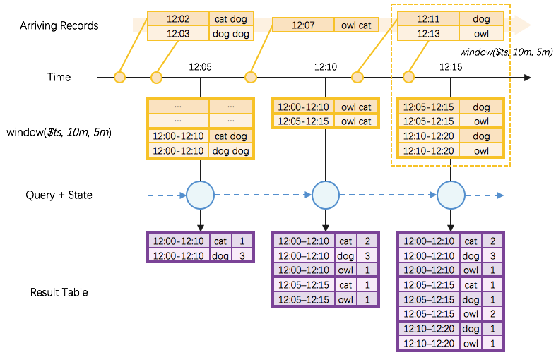
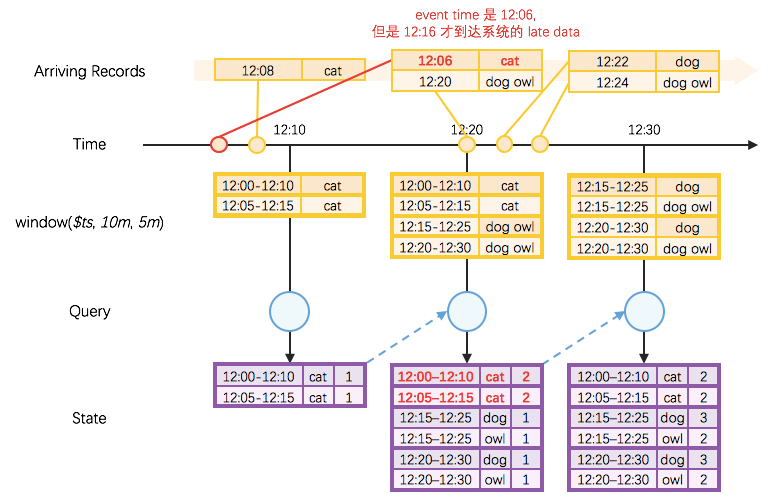
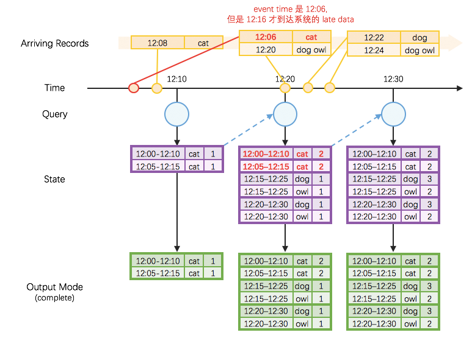
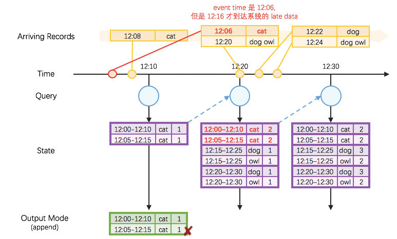
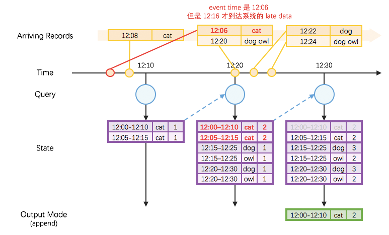
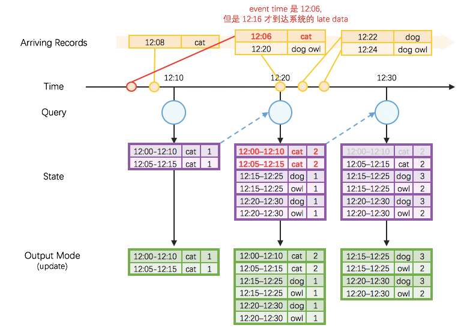

# Structured Streaming 之 Event Time 解析 #

***[酷玩 Spark] Structured Streaming 源码解析系列*** ，返回目录请 [猛戳这里](.)

[「腾讯广告」](http://e.qq.com)技术团队（原腾讯广点通技术团队）荣誉出品

```
本文内容适用范围：
* 2018.11.02 update, Spark 2.4 全系列 √ (已发布：2.4.0)
* 2018.02.28 update, Spark 2.3 全系列 √ (已发布：2.3.0 ~ 2.3.2)
* 2017.07.11 update, Spark 2.2 全系列 √ (已发布：2.2.0 ~ 2.2.3)
```


阅读本文前，请一定先阅读 [Structured Streaming 实现思路与实现概述](1.1%20Structured%20Streaming%20实现思路与实现概述.md) 一文，其中概述了 Structured Streaming 的实现思路，有了全局概念后再看本文的细节解释。

## Event Time !

Spark Streaming 时代有过非官方的 event time 支持尝试 [1]，而在进化后的 Structured Streaming 里，添加了对 event time 的原生支持。

我们来看一段官方 programming guide 的例子 [2]：

```scala
import spark.implicits._

val words = ... // streaming DataFrame of schema { timestamp: Timestamp, word: String }

// Group the data by window and word and compute the count of each group
// Please note: we'll revise this example in <Structured Streaming 之 Watermark 解析>
val windowedCounts = words.groupBy(
  window($"timestamp", "10 minutes", "5 minutes"),
  $"word"
).count()
```

这里的执行过程如下图。

<p align="center"></p>

- 我们有一系列 arriving 的 records
- 首先是一个对着时间列 `timestamp` 做长度为`10m`，滑动为`5m` 的 *window()* 操作
  - 例如上图右上角的虚框部分，当达到一条记录 `12:22|dog` 时，会将 `12:22` 归入两个窗口 `12:15-12:25`、`12:20-12:30`，所以产生两条记录：`12:15-12:25|dog`、`12:20-12:30|dog`，对于记录 `12:24|dog owl` 同理产生两条记录：`12:15-12:25|dog owl`、`12:20-12:30|dog owl`
  - 所以这里 *window()* 操作的本质是 *explode()*，可由一条数据产生多条数据
- 然后对 *window()* 操作的结果，以 `window` 列和 `word` 列为 key，做 *groupBy().count()* 操作
  - 这个操作的聚合过程是增量的（借助 StateStore）
- 最后得到一个有 `window`, `word`, `count` 三列的状态集

## 处理 Late Data

还是沿用前面 *window()* + *groupBy().count()* 的例子，但注意有一条迟到的数据 `12:06|cat` ：

<p align="center"></p>

可以看到，在这里的 late data，在 State 里被正确地更新到了应在的位置。

## OutputModes

我们继续来看前面 *window()* + *groupBy().count()* 的例子，现在我们考虑将结果输出，即考虑 OutputModes：

#### (a) Complete

Complete 的输出是和 State 是完全一致的：

<p align="center"></p>

#### (b) Append

Append 的语义将保证，一旦输出了某条 key，未来就不会再输出同一个 key。

<p align="center"></p>

所以，在上图 `12:10` 这个批次直接输出 `12:00-12:10|cat|1`, `12:05-12:15|cat|1` 将是错误的，因为在 `12:20` 将结果更新为了 `12:00-12:10|cat|2`，但是 Append 模式下却不会再次输出 `12:00-12:10|cat|2`，因为前面输出过了同一条 key `12:00-12:10|cat` 的结果`12:00-12:10|cat|1`。

为了解决这个问题，在 Append 模式下，Structured Streaming 需要知道，某一条 key 的结果什么时候不会再更新了。当确认结果不会再更新的时候（下一篇文章专门详解依靠 watermark 确认结果不再更新），就可以将结果进行输出。

<p align="center"></p>

如上图所示，如果我们确定 `12:30` 这个批次以后不会再有对 `12:00-12:10` 这个 window 的更新，那么我们就可以把 `12:00-12:10` 的结果在 `12:30` 这个批次输出，并且也会保证后面的批次不会再输出 `12:00-12:10` 的 window 的结果，维护了 Append 模式的语义。

#### (c) Update

Update 模式已在 Spark 2.1.1 及以后版本获得正式支持。 

<p align="center"></p>

如上图所示，在 Update 模式中，只有本执行批次 State 中被更新了的条目会被输出：

- 在 12:10 这个执行批次，State 中全部 2 条都是新增的（因而也都是被更新了的），所以输出全部 2 条；
- 在 12:20 这个执行批次，State 中 2 条是被更新了的、 4 条都是新增的（因而也都是被更新了的），所以输出全部 6 条；
- 在 12:30 这个执行批次，State 中 4 条是被更新了的，所以输出 4 条。这些需要特别注意的一点是，如 Append 模式一样，本执行批次中由于（通过  watermark 机制）确认 `12:00-12:10` 这个 window 不会再被更新，因而将其从 State 中去除，但没有因此产生输出。

## 总结

本文解析了 Structured Streaming 原生提供的对 event time 的支持，包括 window()、groupBy() 增量聚合、对 late date 的支持、以及在 Complete, Append, Update 模式下的输出结果。

## 扩展阅读

1. [Github: org/apache/spark/sql/catalyst/analysis/Analyzer.scala#TimeWindowing](https://github.com/apache/spark/blob/v2.1.1/sql/catalyst/src/main/scala/org/apache/spark/sql/catalyst/analysis/Analyzer.scala#L2232)
2. [Github: org/apache/spark/sql/catalyst/expressions/TimeWindow](https://github.com/apache/spark/blob/master/sql/catalyst/src/main/scala/org/apache/spark/sql/catalyst/expressions/TimeWindow.scala)

## 参考资料

1. https://github.com/cloudera/spark-dataflow
2. [Structured Streaming Programming Guide - Window Operations on Event Time](http://spark.apache.org/docs/latest/structured-streaming-programming-guide.html#window-operations-on-event-time)

<br/>
<br/>
（本文完，参与本文的讨论请 [猛戳这里](https://github.com/lw-lin/CoolplaySpark/issues/34)，返回目录请 [猛戳这里](.)）
