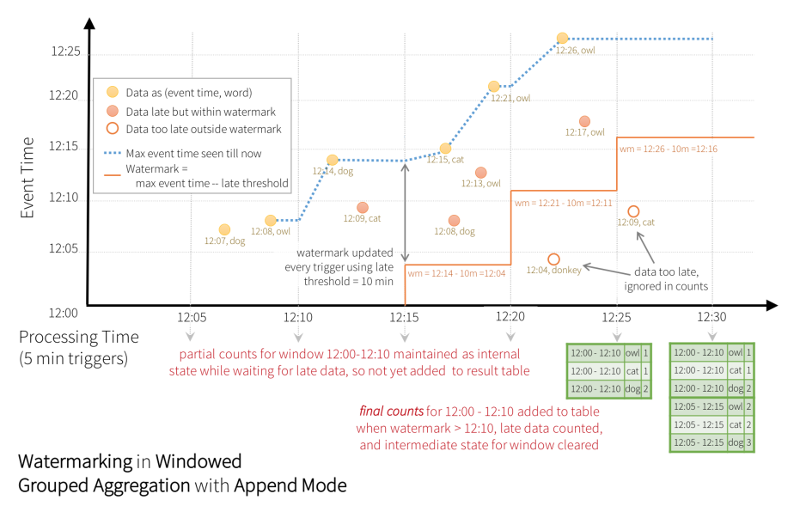

# 4.2 Structured Streaming 之 Watermark 解析 #

***[酷玩 Spark] Structured Streaming 源码解析系列*** ，返回目录请 [猛戳这里](.)

[「腾讯广告」](http://e.qq.com)技术团队（原腾讯广点通技术团队）荣誉出品

```
本文内容适用范围：
* 2018.11.02 update, Spark 2.4 全系列 √ (已发布：2.4.0)
* 2018.02.28 update, Spark 2.3 全系列 √ (已发布：2.3.0 ~ 2.3.2)
* 2017.07.11 update, Spark 2.2 全系列 √ (已发布：2.2.0 ~ 2.2.3)
```


阅读本文前，请一定先阅读  [Structured Streaming 之 Event Time 解析](4.1%20Structured%20Streaming%20之%20Event%20Time%20解析.md)，其中解析了 Structured Streaming 的 Event Time 及为什么需要 Watermark。

## 引言

<p align="center"></p>

我们在前文 [Structured Streaming 之 Event Time 解析](4.1%20Structured%20Streaming%20之%20Event%20Time%20解析.md) 中的例子，在：

- (a) 对 event time 做 *window()* + *groupBy().count()* 即利用状态做跨执行批次的聚合，并且
- (b) 输出模式为 Append 模式

时，需要知道在 `12:30` 结束后不会再有对 `window 12:00-12:10` 的更新，因而可以在 `12:30` 这个批次结束时，输出 `window 12:00-12:10` 的 1 条结果。

## Watermark 机制

对上面这个例子泛化一点，是：

- (a+) 在对 event time 做 *window()* + *groupBy().aggregation()* 即利用状态做跨执行批次的聚合，并且
- (b+) 输出模式为 Append 模式或 Update 模式

时，Structured Streaming 将依靠 watermark 机制来限制状态存储的无限增长、并（对 Append 模式）尽早输出不再变更的结果。

换一个角度，如果既不是 Append 也不是 Update 模式，或者是 Append 或 Update 模式、但不需状态做跨执行批次的聚合时，则不需要启用 watermark 机制。

具体的，我们启用 watermark 机制的方式是：

```scala
val words = ... // streaming DataFrame of schema { timestamp: Timestamp, word: String }

// Group the data by window and word and compute the count of each group
val windowedCounts = words
    .withWatermark("timestamp", "10 minutes")  // 注意这里的 watermark 设置！
    .groupBy(
        window($"timestamp", "10 minutes", "5 minutes"),
        $"word")
    .count()
```

这样即告诉 Structured Streaming，以 `timestamp` 列的最大值为锚点，往前推 10min 以前的数据不会再收到。这个值 —— 当前的最大 timestamp 再减掉 10min —— 这个随着 timestamp 不断更新的 Long 值，就是 watermark。

<p align="center"></p>

所以，在之前的这里图示中：

- 在 `12:20` 这个批次结束后，锚点变成了 `12:20|dog owl` 这条记录的 event time `12:20` ，watermark 变成了 `12:20 - 10min = 12:10`；
- 所以，在 `12:30` 批次结束时，即知道 event time `12:10` 以前的数据不再收到了，因而 window `12:00-12:10` 的结果也不会再被更新，即可以安全地输出结果 `12:00-12:10|cat|2`；
- 在结果 `12:00-12:10|cat|2` 输出以后，State 中也不再保存 window `12:00-12:10` 的相关信息 —— 也即 State Store 中的此条状态得到了清理。

## 图解 Watermark 的进展

下图中的这个来自官方的例子 [1]，直观的解释了 watermark 随着 event time 的进展情况（对应的相关参数仍与前面的例子一致）：

<p align="center"></p>

## 详解 Watermark 的进展

### (a) Watermark 的保存和恢复

我们知道，在每次 StreamExecution 的每次增量执行（即 IncrementalExecution）开始后，首先会在 driver 端持久化相关的 source offsets 到 offsetLog 中，即下图中的步骤 (1)。实际在这个过程中，也将系统当前的 watermark 等值保存了进去。


这样，在故障恢复时，可以从 offsetLog 中恢复出来的 watermark 值；当然在初次启动、还没有 offsetLog 时，watermark 的值会初始化为 0。

### (b) Watermark 用作过滤条件

在每次 StreamExecution 的每次增量执行（即 IncrementalExecution）开始时，将 driver 端的 watermark 最新值（即已经写入到 offsetLog 里的值）作为过滤条件，加入到整个执行的 logicalPlan 中。

具体的是在 Append 和 Complete 模式下，且需要与 StateStore 进行交互时，由如下代码设置过滤条件：

```scala
/** Generate a predicate that matches data older than the watermark */
  private lazy val watermarkPredicate: Option[Predicate] = {
    val optionalWatermarkAttribute =
      keyExpressions.find(_.metadata.contains(EventTimeWatermark.delayKey))

    optionalWatermarkAttribute.map { watermarkAttribute =>
      // If we are evicting based on a window, use the end of the window.  Otherwise just
      // use the attribute itself.
      val evictionExpression =
        if (watermarkAttribute.dataType.isInstanceOf[StructType]) {
          LessThanOrEqual(
            GetStructField(watermarkAttribute, 1),
            Literal(eventTimeWatermark.get * 1000))
        } else {
          LessThanOrEqual(
            watermarkAttribute,
            Literal(eventTimeWatermark.get * 1000))
        }

      logInfo(s"Filtering state store on: $evictionExpression")
      newPredicate(evictionExpression, keyExpressions)
    }
  }
```

总的来讲，就是进行 `event time 的字段 <= watermark` 的过滤。

所以在 Append 模式下，把 StateStore 里符合这个过滤条件的状态进行输出，因为这些状态将来不会再更新了；在 Update 模式下，把符合这个过滤条件的状态删掉，因为这些状态将来不会再更新了。

### (c) Watermark 的更新

在单次增量执行的过程中，按照每个 partition 即每个 task，在处理每一条数据时，同时收集 event time 的（统计）数字：

```scala
// 来自 EventTimeWatermarkExec
case class EventTimeStats(var max: Long, var min: Long, var sum: Long, var count: Long) {
  def add(eventTime: Long): Unit = {
    this.max = math.max(this.max, eventTime)
    this.min = math.min(this.min, eventTime)
    this.sum += eventTime
    this.count += 1
  }

  def merge(that: EventTimeStats): Unit = {
    this.max = math.max(this.max, that.max)
    this.min = math.min(this.min, that.min)
    this.sum += that.sum
    this.count += that.count
  }

  def avg: Long = sum / count
}
```

那么每个 partition 即每个 task，收集到了 event time 的 `max`, `min`, `sum`, `count` 值。在整个 job 结束时，各个 partition 即各个 task 的 `EventTimeStats` ，收集到 driver 端。

在 driver 端，在每次增量执行结束后，把收集到的所有的 eventTimeStats 取最大值，并进一步按需更新 watermark（本次可能更新，也可能不更新）：

```scala
// 来自 StreamExecution
lastExecution.executedPlan.collect {
  case e: EventTimeWatermarkExec if e.eventTimeStats.value.count > 0 =>
    logDebug(s"Observed event time stats: ${e.eventTimeStats.value}")
    /* 所收集的 eventTimeStats 的 max 值，减去之前 withWatermark() 时指定的 delayMS 值 */
    /* 结果保存为 newWatermarkMs */
    e.eventTimeStats.value.max - e.delayMs
    }.headOption.foreach { newWatermarkMs =>
  /* 比较 newWatermarkMs 与当前的 batchWatermarkMs */
  if (newWatermarkMs > offsetSeqMetadata.batchWatermarkMs) {
    /* 将当前的 batchWatermarkMs 的更新为 newWatermarkMs */
    logInfo(s"Updating eventTime watermark to: $newWatermarkMs ms")
    offsetSeqMetadata.batchWatermarkMs = newWatermarkMs
  } else {
    /* 当前的 batchWatermarkMs 不需要更新 */
    logDebug(
      s"Event time didn't move: $newWatermarkMs < " +
      s"${offsetSeqMetadata.batchWatermarkMs}")
  }
}
```

所以我们看，在单次增量执行过程中，具体的是在做 `(b) Watermark 用作过滤条件` 的过滤过程中，watermark 维持不变。

直到在单次增量执行结束时，根据收集到的 eventTimeStats，才更新一个 watermark。更新后的 watermark 会被保存和故障时恢复，这个过程是我们在 `(a) Watermark 的保存和恢复` 中解析的。

## 关于 watermark 的一些说明

关于 Structured Streaming 的目前 watermark 机制，我们有几点说明：

1. 再次强调，(a+) 在对 event time 做 *window()* + *groupBy().aggregation()* 即利用状态做跨执行批次的聚合，并且 (b+) 输出模式为 Append 模式或 Update 模式时，才需要 watermark，其它时候不需要；
2. watermark 的本质是要帮助 StateStore 清理状态、不至于使 StateStore 无限增长；同时，维护 Append 正确的语义（即判断在何时某条结果不再改变、从而将其输出）；
3. 目前版本（Spark 2.2）的 watermark 实现，是依靠最大 event time 减去一定 late threshold 得到的，尚未支持 Source 端提供的 watermark；
   - 未来可能的改进是，从 Source 端即开始提供关于 watermark 的特殊信息，传递到 StreamExecution 中使用 [2]，这样可以加快 watermark 的进展，从而能更早的得到输出数据
4. Structured Streaming 对于 watermark 的承诺是：(a) watermark 值不后退（包括正常运行和发生故障恢复时）；(b) watermark 值达到后，大多时候会在下一个执行批次输出结果，但也有可能延迟一两个批次（发生故障恢复时），上层应用不应该对此有依赖。

## 扩展阅读

1. [Github: org/apache/spark/sql/execution/streaming/StatefulAggregate.scala](https://github.com/apache/spark/blob/master/sql/core/src/main/scala/org/apache/spark/sql/execution/streaming/StatefulAggregate.scala)
2. [Flink Doc: Generating Timestamps / Watermarks](https://ci.apache.org/projects/flink/flink-docs-master/dev/event_timestamps_watermarks.html)

## 参考资料

1. [Structured Streaming Programming Guide](http://spark.apache.org/docs/latest/structured-streaming-programming-guide.html)
2. [Design Doc: Structured Streaming Watermarks for handling late data and dropping old aggregates](https://docs.google.com/document/d/1z-Pazs5v4rA31azvmYhu4I5xwqaNQl6ZLIS03xhkfCQ/edit)

<br/>
<br/>
（本文完，参与本文的讨论请 [猛戳这里](https://github.com/lw-lin/CoolplaySpark/issues/35)，返回目录请 [猛戳这里](.)）
